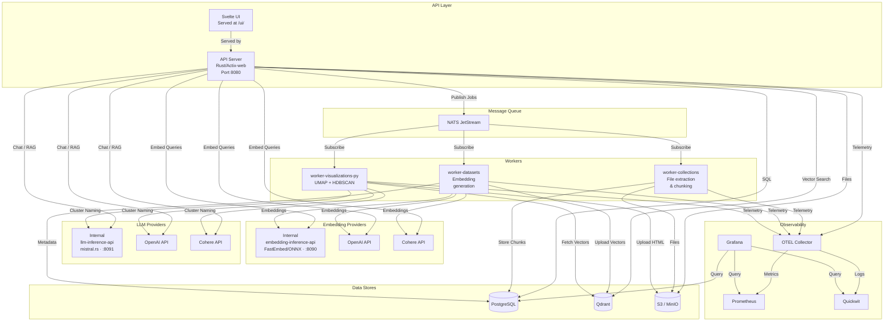
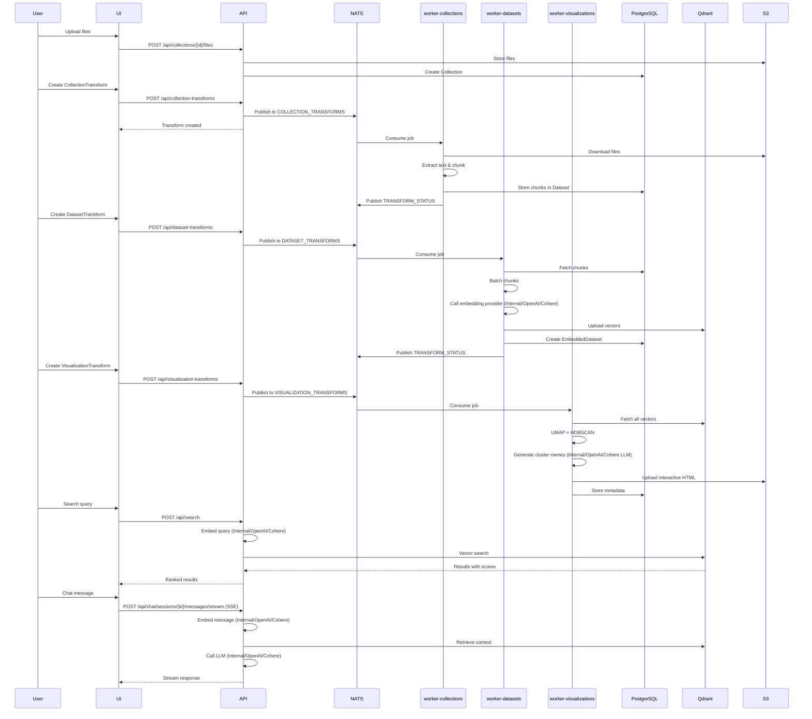

# Semantic Explorer

<div align="center">


**A distributed platform for document processing, vector embedding generation, interactive visualization, and semantic search with RAG-enabled chat capabilities.**

[Features](#overview) •
[Architecture](#architecture) •
[Quick Start](#deployment) •
[API Reference](#api-endpoints) •
[Configuration](#environment-variables)

</div>

---

## Overview

Semantic Explorer is a microservices-based platform that enables organizations to:

1. **Ingest documents** from multiple file formats into collections
2. **Extract and chunk** text content using specialized workers
3. **Generate vector embeddings** using local or cloud-based embedding models
4. **Create interactive visualizations** using UMAP dimensionality reduction with HDBSCAN clustering
5. **Perform semantic search** across embedded datasets using Qdrant vector database
6. **Chat with documents** via RAG (Retrieval-Augmented Generation) with streaming responses
7. **Share resources** through a public marketplace for collaboration

The platform uses a message-driven architecture with NATS JetStream for job orchestration, PostgreSQL for metadata, Qdrant for vector storage, and S3 for file storage.

---

## Architecture



### Data Flow Sequence



---

## Supported Capabilities

### Document Processing

| Format Type | Supported Formats |
|-------------|------------------|
| **Text** | `text/plain`, `text/csv`, `text/markdown`, `text/html`, `text/xml`, `text/rtf`, `text/x-log`, `text/x-syslog` |
| **PDF** | `application/pdf` |
| **Microsoft Word** | `.doc`, `.docx`, `.docm`, `.dotm`, `.dotx` |
| **Microsoft Excel** | `.xls`, `.xlsx`, `.xlsm`, `.xltm`, `.xltx`, `.xlam`, `.xlsb` |
| **Microsoft PowerPoint** | `.ppt`, `.pptx` |
| **OpenDocument** | `.odt`, `.ods`, `.odp` |
| **E-books** | `application/epub+zip`, `application/epub` |
| **Data** | `application/json`, `application/x-ndjson`, `text/json`, `text/x-ndjson` |
| **Email** | `message/rfc822` (`.eml` files) |
| **Archives** | `application/zip`, `application/x-zip-compressed`, `application/x-7z-compressed`, `application/gzip`, `application/x-gzip` |

**File Upload Limits:**
- Maximum file size: 100 MB per file
- Magic byte verification for MIME type detection

### Embedding Providers

| Provider | Description |
|-----------|-------------|
| **Internal** | FastEmbed/ONNX models via [`embedding-inference-api`](crates/embedding-inference-api/) |
| **OpenAI** | OpenAI embedding API |
| **Cohere** | Cohere embedding API |

### LLM Providers

| Provider | Description |
|-----------|-------------|
| **Internal** | mistral.rs engine with GGUF/GPTQ quantization support via [`llm-inference-api`](crates/llm-inference-api/) |
| **OpenAI** | OpenAI chat API |
| **Cohere** | Cohere chat API |

### Vector Database

- **Qdrant** for vector storage and similarity search
- GPU-accelerated indexing support
- Configurable quantization: `none`, `scalar`, `product`

---

## Project Structure

```
semantic-explorer/
├── crates/
│   ├── api/                          # Main API server (Rust)
│   ├── core/                         # Shared library & utilities (Rust)
│   ├── worker-collections/           # File extraction worker (Rust)
│   ├── worker-datasets/              # Embedding worker (Rust)
│   ├── worker-visualizations-py/     # Visualization worker (Python)
│   ├── embedding-inference-api/      # Local embedding server (Rust)
│   └── llm-inference-api/            # Local LLM server (Rust)
├── semantic-explorer-ui/             # Svelte frontend
├── deployment/
│   ├── compose/                      # Docker Compose configs
│   └── helm/                         # Kubernetes/Helm charts
└── README.md
```

### Component Documentation

| Component | Description | Documentation |
|-----------|-------------|----------------|
| **API Server** | REST API, authentication, search, chat | See API endpoints below |
| **Core Library** | Shared configuration, observability, NATS setup | [`crates/core/`](crates/core/) |
| **Collections Worker** | File extraction and chunking | [`crates/worker-collections/`](crates/worker-collections/) |
| **Datasets Worker** | Embedding generation | [`crates/worker-datasets/`](crates/worker-datasets/) |
| **Visualizations Worker** | UMAP/HDBSCAN processing | [`crates/worker-visualizations-py/`](crates/worker-visualizations-py/) |
| **Embedding Inference API** | Local embedding server (FastEmbed) | [`crates/embedding-inference-api/`](crates/embedding-inference-api/) |
| **LLM Inference API** | Local LLM server with quantization support (mistral.rs) | [`crates/llm-inference-api/`](crates/llm-inference-api/) |
| **Svelte UI** | Frontend application | [`semantic-explorer-ui/`](semantic-explorer-ui/) |

---

## API Endpoints

### Collections
| Method | Endpoint | Description |
|---------|----------|-------------|
| `GET` | `/api/collections` | List collections (paginated) |
| `GET` | `/api/collections/{collection_id}` | Get collection details |
| `POST` | `/api/collections` | Create collection |
| `PATCH` | `/api/collections/{collection_id}` | Update collection |
| `DELETE` | `/api/collections/{collection_id}` | Delete collection |
| `POST` | `/api/collections/{collection_id}/files` | Upload files to collection |
| `GET` | `/api/collections/{collection_id}/files` | List collection files |
| `GET` | `/api/collections/{collection_id}/files/{file_key}` | Download file |
| `DELETE` | `/api/collections/{collection_id}/files/{file_key}` | Delete file |
| `GET` | `/api/collections/search` | Search collections |
| `GET` | `/api/collections-allowed-file-types` | Get allowed MIME types |

### Datasets
| Method | Endpoint | Description |
|---------|----------|-------------|
| `GET` | `/api/datasets` | List datasets (paginated) |
| `GET` | `/api/datasets/{dataset_id}` | Get dataset details |
| `POST` | `/api/datasets` | Create dataset |
| `PATCH` | `/api/datasets/{dataset_id}` | Update dataset |
| `DELETE` | `/api/datasets/{dataset_id}` | Delete dataset |
| `GET` | `/api/datasets/{dataset_id}/items` | Get dataset items |
| `GET` | `/api/datasets/{dataset_id}/items-summary` | Get dataset items summary |
| `GET` | `/api/datasets/{dataset_id}/items/{item_id}/chunks` | Get item chunks |
| `DELETE` | `/api/datasets/{dataset_id}/items/{item_id}` | Delete dataset item |
| `POST` | `/api/datasets/{dataset_id}/items` | Upload to dataset |

### Embedded Datasets
| Method | Endpoint | Description |
|---------|----------|-------------|
| `GET` | `/api/embedded-datasets` | List embedded datasets |
| `GET` | `/api/embedded-datasets/{embedded_dataset_id}` | Get embedded dataset details |
| `PATCH` | `/api/embedded-datasets/{embedded_dataset_id}` | Update embedded dataset |
| `DELETE` | `/api/embedded-datasets/{embedded_dataset_id}` | Delete embedded dataset |
| `GET` | `/api/embedded-datasets/{embedded_dataset_id}/stats` | Get statistics |
| `POST` | `/api/embedded-datasets/batch-stats` | Batch stats for multiple |
| `GET` | `/api/embedded-datasets/{embedded_dataset_id}/points` | Get vector points |
| `GET` | `/api/embedded-datasets/{embedded_dataset_id}/points/{point_id}/vector` | Get point vector |
| `GET` | `/api/embedded-datasets/{embedded_dataset_id}/processed-batches` | Get processed batches |
| `GET` | `/api/datasets/{dataset_id}/embedded-datasets` | Get embedded datasets for dataset |
| `POST` | `/api/embedded-datasets/standalone` | Create standalone embedded dataset |
| `POST` | `/api/embedded-datasets/{embedded_dataset_id}/push-vectors` | Push vectors to embedded dataset |

### Embedders
| Method | Endpoint | Description |
|---------|----------|-------------|
| `GET` | `/api/embedders` | List embedders |
| `GET` | `/api/embedders/{embedder_id}` | Get embedder details |
| `POST` | `/api/embedders` | Create embedder |
| `PATCH` | `/api/embedders/{embedder_id}` | Update embedder |
| `DELETE` | `/api/embedders/{embedder_id}` | Delete embedder |
| `POST` | `/api/embedders/{embedder_id}/test` | Test embedder |

### LLMs
| Method | Endpoint | Description |
|---------|----------|-------------|
| `GET` | `/api/llms` | List LLMs |
| `GET` | `/api/llms/{llm_id}` | Get LLM details |
| `POST` | `/api/llms` | Create LLM |
| `PATCH` | `/api/llms/{llm_id}` | Update LLM |
| `DELETE` | `/api/llms/{llm_id}` | Delete LLM |

### Marketplace
| Method | Endpoint | Description |
|---------|----------|-------------|
| `GET` | `/api/marketplace/collections` | List public collections |
| `GET` | `/api/marketplace/collections/recent` | Get recent public collections |
| `POST` | `/api/marketplace/collections/{id}/grab` | Grab public collection |
| `GET` | `/api/marketplace/datasets` | List public datasets |
| `GET` | `/api/marketplace/datasets/recent` | Get recent public datasets |
| `POST` | `/api/marketplace/datasets/{id}/grab` | Grab public dataset |
| `GET` | `/api/marketplace/embedders` | List public embedders |
| `GET` | `/api/marketplace/embedders/recent` | Get recent public embedders |
| `POST` | `/api/marketplace/embedders/{id}/grab` | Grab public embedder |
| `GET` | `/api/marketplace/llms` | List public LLMs |
| `GET` | `/api/marketplace/llms/recent` | Get recent public LLMs |
| `POST` | `/api/marketplace/llms/{id}/grab` | Grab public LLM |

### Search
| Method | Endpoint | Description |
|---------|----------|-------------|
| `POST` | `/api/search` | Semantic search across embedded datasets |

### Chat
| Method | Endpoint | Description |
|---------|----------|-------------|
| `GET` | `/api/chat/sessions` | List chat sessions |
| `POST` | `/api/chat/sessions` | Create chat session |
| `GET` | `/api/chat/sessions/{session_id}` | Get chat session details |
| `DELETE` | `/api/chat/sessions/{session_id}` | Delete chat session |
| `GET` | `/api/chat/sessions/{session_id}/messages` | Get chat messages |
| `POST` | `/api/chat/sessions/{session_id}/messages` | Send chat message |
| `POST` | `/api/chat/sessions/{session_id}/messages/stream` | Stream chat message (SSE) |
| `POST` | `/api/chat/messages/{message_id}/regenerate` | Regenerate assistant message |

### Transforms
| Method | Endpoint | Description |
|---------|----------|-------------|
| `GET` | `/api/collection-transforms` | List collection transforms |
| `GET` | `/api/collection-transforms/{transform_id}` | Get collection transform |
| `POST` | `/api/collection-transforms` | Create collection transform |
| `PATCH` | `/api/collection-transforms/{transform_id}` | Update collection transform |
| `DELETE` | `/api/collection-transforms/{transform_id}` | Delete collection transform |
| `GET` | `/api/collection-transforms/{transform_id}/stats` | Get transform statistics |
| `POST` | `/api/collection-transforms/batch-stats` | Batch stats for multiple |
| `GET` | `/api/collection-transforms/{transform_id}/processed-files` | List processed files |
| `GET` | `/api/collection-transforms/stream` | Stream transform status (SSE) |
| `POST` | `/api/collection-transforms/{transform_id}/trigger` | Trigger transform |
| `GET` | `/api/collections/{collection_id}/transforms` | Get transforms for collection |
| `GET` | `/api/collections/{collection_id}/failed-files` | Get failed files |
| `GET` | `/api/datasets/{dataset_id}/collection-transforms` | Get transforms for dataset |
| `GET` | `/api/dataset-transforms` | List dataset transforms |
| `GET` | `/api/dataset-transforms/{transform_id}` | Get dataset transform |
| `POST` | `/api/dataset-transforms` | Create dataset transform |
| `PATCH` | `/api/dataset-transforms/{transform_id}` | Update dataset transform |
| `DELETE` | `/api/dataset-transforms/{transform_id}` | Delete dataset transform |
| `GET` | `/api/dataset-transforms/{transform_id}/stats` | Get transform statistics |
| `GET` | `/api/dataset-transforms/{transform_id}/detailed-stats` | Get detailed stats |
| `POST` | `/api/dataset-transforms-batch-stats` | Batch stats for multiple |
| `GET` | `/api/dataset-transforms/{transform_id}/batches` | List batches |
| `GET` | `/api/dataset-transforms/{transform_id}/batches/{batch_id}` | Get batch |
| `GET` | `/api/dataset-transforms/{transform_id}/batches/stats` | Batch stats |
| `POST` | `/api/dataset-transforms/{transform_id}/retry-failed` | Retry failed batches |
| `GET` | `/api/dataset-transforms/stream` | Stream transform status (SSE) |
| `POST` | `/api/dataset-transforms/{transform_id}/trigger` | Trigger transform |
| `GET` | `/api/datasets/{dataset_id}/transforms` | Get transforms for dataset |
| `GET` | `/api/visualization-transforms` | List visualization transforms |
| `GET` | `/api/visualization-transforms/{transform_id}` | Get visualization transform |
| `POST` | `/api/visualization-transforms` | Create visualization transform |
| `PATCH` | `/api/visualization-transforms/{transform_id}` | Update visualization transform |
| `DELETE` | `/api/visualization-transforms/{transform_id}` | Delete visualization transform |
| `GET` | `/api/visualization-transforms/{transform_id}/stats` | Get transform statistics |
| `GET` | `/api/visualization-transforms/{transform_id}/visualizations` | List visualizations |
| `GET` | `/api/visualization-transforms/{transform_id}/visualizations/{visualization_id}` | Get visualization |
| `GET` | `/api/visualization-transforms/{transform_id}/visualizations/{visualization_id}/download` | Download visualization HTML |
| `GET` | `/api/visualizations/recent` | Get recent visualizations |
| `GET` | `/api/embedded-datasets/{id}/visualizations` | Get visualizations by embedded dataset |
| `GET` | `/api/visualization-transforms/stream` | Stream transform status (SSE) |
| `POST` | `/api/visualization-transforms/{transform_id}/trigger` | Trigger transform |

### Health & System
| Method | Endpoint | Description |
|---------|----------|-------------|
| `GET` | `/health/live` | Liveness probe |
| `GET` | `/health/ready` | Readiness probe |
| `GET` | `/api/users/@me` | Get current authenticated user |
| `GET` | `/api/status/nats` | Get NATS connection status |
| `GET` | `/swagger-ui` | OpenAPI/Swagger UI |

---

## Technologies Used

### Backend (Rust)

| Technology | Version | Purpose |
|-----------|----------|---------|
| **Actix-web** | 4.12.1 | Web framework |
| **async-nats** | 0.46.0 | NATS JetStream client |
| **sqlx** | 0.8.6 | PostgreSQL database client |
| **qdrant-client** | 1.16.0 | Qdrant vector database client |
| **aws-sdk-s3** | 1.121.0 | S3-compatible storage client |
| **utoipa** | 5.4.0 | OpenAPI specification generation |
| **tokio** | 1.49.0 | Async runtime |
| **tracing** | 0.1.43 | Structured logging |
| **opentelemetry** | 0.31.0 | Observability framework |
| **serde** | 1.0.228 | Serialization/deserialization |

### Worker (Python)

| Technology | Purpose |
|-----------|---------|
| **UMAP** | Dimensionality reduction for visualizations |
| **HDBSCAN** | Density-based clustering for visualizations |

### Frontend

| Technology | Version | Purpose |
|-----------|----------|---------|
| **Svelte** | 5.50.0 | Reactive UI framework |
| **Vite** | 7.3.1 | Build tool (rolldown-vite) |
| **Tailwind CSS** | 4.1.18 | Styling |
| **Flowbite Svelte** | 1.31.0 | UI component library |
| **Deck.gl** | 9.2.6 | WebGL visualization rendering |
| **marked** | 17.0.1 | Markdown rendering |
| **highlight.js** | 11.11.1 | Code syntax highlighting |

### Infrastructure

| Service | Purpose |
|----------|---------|
| **PostgreSQL 16.3** | Metadata storage |
| **Qdrant (GPU)** | Vector storage and search |
| **MinIO** | Distributed S3-compatible storage (4-node cluster) |
| **NATS 2.10** | Message queue (3-node JetStream cluster) |
| **Dex** | OIDC authentication provider |
| **Prometheus** | Metrics collection |
| **Grafana** | Metrics visualization |
| **Quickwit** | Log aggregation |
| **OpenTelemetry Collector** | Telemetry aggregation |

---

## Deployment

### Prerequisites

- **Docker & Docker Compose** v2.0+
- **NVIDIA GPU** (optional, for local inference APIs — CUDA 12.x required)
- **Rust** 1.85+ (for development — Edition 2024)
- **Python** 3.12+ (for visualization worker development)
- **Node.js** 20+ (for UI development)

### Development Stack

```bash
# Clone the repository
git clone https://github.com/FishySoftware/semantic-explorer.git
cd semantic-explorer

# Start infrastructure services (MinIO, Qdrant, PostgreSQL, NATS, observability)
cd deployment/compose
docker compose -f compose.dev.yaml up -d

# Check service health
docker compose -f compose.dev.yaml ps

# View logs
docker compose -f compose.dev.yaml logs -f

# Access the UI
open http://localhost:8080
```

The dev stack includes:
- Infrastructure: MinIO (4-node cluster), Qdrant (GPU), PostgreSQL, NATS (3-node cluster), Dex, Prometheus, Grafana, Quickwit, OTEL Collector
- Application services: API server, 3 workers, 2 inference APIs (commented out in dev compose)

### Production Deployment

```bash
cd deployment/compose
docker compose -f compose.yaml up -d
```

For Kubernetes deployments, use the provided Helm charts:

```bash
cd deployment/helm/semantic-explorer
helm install semantic-explorer . -f values.yaml
```

See [`deployment/helm/`](deployment/helm/) for detailed Helm chart configuration.

---

## Environment Variables

### Server Configuration

| Variable | Default | Required | Description |
|-----------|----------|----------|-------------|
| `HOSTNAME` | `localhost` | No | Server bind address |
| `PORT` | `8080` | No | Server port |
| `PUBLIC_URL` | - | No | External URL for OIDC callbacks |
| `CORS_ALLOWED_ORIGINS` | - | No | Comma-separated allowed origins |
| `STATIC_FILES_DIR` | `./semantic-explorer-ui/` | No | Path to static UI files |
| `SHUTDOWN_TIMEOUT_SECS` | `30` | No | Graceful shutdown timeout |

### Database (PostgreSQL)

| Variable | Default | Required | Description |
|-----------|----------|----------|-------------|
| `DATABASE_URL` | - | **Yes** | PostgreSQL connection string |
| `DB_MAX_CONNECTIONS` | `15` | No | Maximum pool connections |
| `DB_MIN_CONNECTIONS` | `2` | No | Minimum pool connections |
| `DB_ACQUIRE_TIMEOUT_SECS` | `30` | No | Connection acquire timeout |
| `DB_IDLE_TIMEOUT_SECS` | `300` | No | Idle connection timeout |
| `DB_MAX_LIFETIME_SECS` | `1800` | No | Maximum connection lifetime |

### NATS JetStream

| Variable | Default | Required | Description |
|-----------|----------|----------|-------------|
| `NATS_URL` | `nats://localhost:4222` | No | NATS server URL |
| `NATS_REPLICAS` | `3` | No | Stream replica count |

### Qdrant Vector Database

| Variable | Default | Required | Description |
|-----------|----------|----------|-------------|
| `QDRANT_URL` | `http://localhost:6334` | No | Qdrant gRPC endpoint |
| `QDRANT_API_KEY` | - | No | API key for authentication |
| `QDRANT_TIMEOUT_SECS` | `30` | No | Request timeout |
| `QDRANT_CONNECT_TIMEOUT_SECS` | `10` | No | Connection timeout |
| `QDRANT_QUANTIZATION_TYPE` | `none` | No | `none`, `scalar`, or `product` |

### S3-Compatible Storage

| Variable | Default | Required | Description |
|-----------|----------|----------|-------------|
| `AWS_REGION` | - | **Yes** | AWS region |
| `AWS_ACCESS_KEY_ID` | - | No* | Access key (or use IAM roles) |
| `AWS_SECRET_ACCESS_KEY` | - | No* | Secret key (or use IAM roles) |
| `AWS_ENDPOINT_URL` | - | **Yes** | S3 endpoint (e.g., MinIO URL) |
| `S3_BUCKET_NAME` | - | **Yes** | Bucket name for all storage |
| `S3_MAX_DOWNLOAD_SIZE_BYTES` | `104857600` (100MB) | No | Max download size |
| `S3_MAX_UPLOAD_SIZE_BYTES` | `1073741824` (1GB) | No | Max upload size |

*Required unless using IAM roles/instance profiles

### Authentication (OIDC)

| Variable | Default | Required | Description |
|-----------|----------|----------|-------------|
| `OIDC_CLIENT_ID` | - | **Yes** | OIDC client identifier |
| `OIDC_CLIENT_SECRET` | - | **Yes** | OIDC client secret |
| `OIDC_ISSUER_URL` | - | **Yes** | OIDC issuer URL |
| `OIDC_USE_PKCE` | `false` | No | Enable PKCE flow |
| `OIDC_SESSION_MANAGEMENT_ENABLED` | `true` | No | Enable session management |
| `OIDC_SESSION_TIMEOUT_SECS` | `3600` | No | Session timeout (1 hour) |
| `OIDC_INACTIVITY_TIMEOUT_SECS` | `1800` | No | Inactivity timeout (30 min) |
| `OIDC_MAX_CONCURRENT_SESSIONS` | `5` | No | Max sessions per user |
| `OIDC_REFRESH_TOKEN_ROTATION_ENABLED` | `true` | No | Enable token rotation |

### Encryption & TLS

| Variable | Default | Required | Description |
|-----------|----------|----------|-------------|
| `ENCRYPTION_MASTER_KEY` | - | **Yes** | 32-byte hex key for AES-256-GCM |
| `SERVER_SSL_ENABLED` | `false` | No | Enable HTTPS |
| `TLS_SERVER_CERT_PATH` | - | If SSL | Path to server certificate |
| `TLS_SERVER_KEY_PATH` | - | If SSL | Path to server private key |
| `CLIENT_MTLS_ENABLED` | `false` | No | Enable mutual TLS for clients |
| `TLS_CLIENT_CERT_PATH` | - | If mTLS | Path to client certificate |
| `TLS_CLIENT_KEY_PATH` | - | If mTLS | Path to client private key |
| `TLS_CA_CERT_PATH` | - | No | CA bundle path (uses system if unset) |

### Observability

| Variable | Default | Required | Description |
|-----------|----------|----------|-------------|
| `SERVICE_NAME` | `semantic-explorer` | No | Service name for telemetry |
| `OTEL_EXPORTER_OTLP_ENDPOINT` | `http://localhost:4317` | No | OTLP collector endpoint |
| `LOG_FORMAT` | `json` | No | `json` or `pretty` |
| `RUST_LOG` | - | No | Rust log filter (e.g., `info,semantic_explorer=debug`) |
| `LOG_LEVEL` | `INFO` | No | Python log level |

### Reconciliation & Reliability

| Variable | Default | Required | Description |
|-----------|----------|----------|-------------|
| `RECONCILIATION_INTERVAL_SECS` | `300` | No | Interval for reconciliation job (recovers failed batch publishes) |

### Scalability & Performance

The platform includes several features for high-availability deployments (100K+ users).

#### Adaptive Concurrency & Self-Pacing

Workers automatically adjust their concurrency based on downstream service health:
- **503 backpressure**: When downstream services return 503, workers halve their effective concurrency
- **Automatic recovery**: Concurrency gradually scales back up after pressure subsides
- **Health endpoints**: `/healthz`, `/readyz`, `/status` on each worker for Kubernetes probes

#### Hardcoded Defaults

NATS consumer tuning, circuit breaker, and retry policy parameters use production-tested
defaults and no longer require environment variables. This eliminates ~40 configuration
variables while maintaining the same resilience behavior.

### Inference APIs

| Variable | Default | Required | Description |
|-----------|----------|----------|-------------|
| `EMBEDDING_INFERENCE_API_URL` | `http://localhost:8090` | No | Local embedding API URL |
| `EMBEDDING_INFERENCE_API_TIMEOUT_SECS` | `120` | No | Request timeout |
| `LLM_INFERENCE_API_URL` | `http://localhost:8091` | No | Local LLM API URL |
| `LLM_INFERENCE_API_TIMEOUT_SECS` | `120` | No | Request timeout |

#### Embedding Inference API Specific

| Variable | Default | Required | Description |
|-----------|----------|----------|-------------|
| `INFERENCE_HOSTNAME` | `0.0.0.0` | No | Server bind address |
| `INFERENCE_PORT` | `8090` | No | Server port |
| `INFERENCE_ALLOWED_EMBEDDING_MODELS` | - | **Yes** | Comma-separated model list |
| `INFERENCE_ALLOWED_RERANK_MODELS` | - | No | Comma-separated reranker list |
| `INFERENCE_MAX_BATCH_SIZE` | `128` | No | Max batch size |
| `INFERENCE_MAX_CONCURRENT_REQUESTS` | `2` | No | Concurrent request limit |
| `HF_HOME` | `/models` | No | HuggingFace cache directory |

#### LLM Inference API Specific

| Variable | Default | Required | Description |
|-----------|----------|----------|-------------|
| `LLM_INFERENCE_HOSTNAME` | `0.0.0.0` | No | Server bind address |
| `LLM_INFERENCE_PORT` | `8091` | No | Server port |
| `LLM_ALLOWED_MODELS` | - | **Yes** | Comma-separated list of allowed model IDs |
| `LLM_MAX_CONCURRENT_REQUESTS` | `2` | No | Concurrent request limit |
| `LLM_DEFAULT_TEMPERATURE` | `0.7` | No | Default sampling temperature |
| `LLM_DEFAULT_TOP_P` | `0.9` | No | Default top-p sampling |
| `LLM_DEFAULT_MAX_TOKENS` | `512` | No | Default max tokens |
| `LLM_MAX_TOKENS_LIMIT` | `4096` | No | Maximum allowed tokens |
| `LLM_ENABLE_ISQ` | `false` | No | Enable runtime quantization (slow, not cached) |
| `LLM_ISQ_TYPE` | - | No | ISQ quantization type (Q4_K, Q8_0, etc.) |
| `HF_HOME` | `/models` | No | HuggingFace cache directory |
| `HF_ENDPOINT` | - | No | HuggingFace mirror URL |

> **Tip**: Use pre-quantized GGUF models (e.g., `TheBloke/Mistral-7B-Instruct-v0.2-GGUF`) for fast loading.

### Worker Configuration

| Variable | Default | Required | Description |
|-----------|----------|----------|-------------|
| `MAX_CONCURRENT_JOBS` | `10` | No | Concurrent jobs per worker |
| `PROCESSING_TIMEOUT_SECS` | `3600` | No | Job timeout |
| `WORKER_ID` | UUID | No | Unique worker identifier |
| `NATS_STREAM_RETRY_ATTEMPTS` | `30` | No | Stream connection retries |
| `NATS_STREAM_RETRY_DELAY` | `2.0` | No | Retry delay in seconds |
| `NATS_BATCH_SIZE` | `1` | No | Messages per fetch |
| `NATS_FETCH_TIMEOUT` | `5.0` | No | Fetch timeout in seconds |
| `PROMETHEUS_METRICS_PORT` | `9090` | No | Metrics endpoint port |

---

## Building from Source

### Rust Crates

#### Standard Build (CPU-only)

```bash
# Debug build
cargo build

# Release build (optimized)
cargo build --release

# Build specific crate
cargo build -p semantic-explorer
cargo build -p worker-collections
```

#### CUDA Build (GPU acceleration for inference APIs)

For systems with NVIDIA GPUs, the inference APIs support CUDA acceleration:

```bash
# 1. One-time setup (downloads ONNX Runtime with CUDA support)
./setup_cuda.sh

# 2. Build with CUDA support
./cargo_cuda.sh build --release

# Or build specific inference APIs
./cargo_cuda.sh build -p embedding-inference-api --release
./cargo_cuda.sh build -p llm-inference-api --release
```

**Requirements:**
- NVIDIA GPU with CUDA 12.x drivers
- `nvidia-smi` command available
- Sufficient disk space (~500MB for ONNX Runtime)

### UI

```bash
cd semantic-explorer-ui
npm install
npm run build
```

### Docker Images

```bash
# API server
docker build -f crates/api/Dockerfile -t semantic-explorer:latest .

# Workers
docker build -f crates/worker-collections/Dockerfile -t worker-collections:latest .
docker build -f crates/worker-datasets/Dockerfile -t worker-datasets:latest .
docker build -f crates/worker-visualizations-py/Dockerfile -t worker-visualizations-py:latest .

# Inference APIs (requires CUDA)
docker build -f crates/embedding-inference-api/Dockerfile -t embedding-inference-api:latest .
docker build -f crates/llm-inference-api/Dockerfile -t llm-inference-api:latest .
```

---

## Testing

```bash
# Run all Rust tests
cargo test

# Run tests for specific crate
cargo test -p semantic-explorer-core

# With logging
RUST_LOG=debug cargo test -- --nocapture

# Python tests
cd crates/worker-visualizations-py
python -m pytest tests/

# UI tests
cd semantic-explorer-ui
npm test
```

---

## Observability

### Endpoints

| Service | Metrics | Health |
|---------|---------|--------|
| API Server | `:8080/metrics` | `:8080/health/live`, `:8080/health/ready` |
| Embedding API | `:8090/metrics` | `:8090/health/live`, `:8090/health/ready` |
| LLM API | `:8091/metrics` | `:8091/health/live`, `:8091/health/ready` |
| Viz Worker | `:9090/metrics` | `:8081/health/live`, `:8081/health/ready` |

### Dashboards (Dev Stack)

| Service | URL |
|---------|-----|
| **Grafana** | http://localhost:3000 (admin/admin) |
| **Prometheus** | http://localhost:9090 |
| **Quickwit** | http://localhost:7280 |

### Metrics Categories

- **HTTP**: Request count, duration, status codes
- **Database**: Query duration, connection pool stats
- **Workers**: Job count, duration, success/failure rates
- **Search**: Query latency, embedder performance
- **NATS**: Message backlog, consumer lag

---

## Security

### Authentication

OIDC (OpenID Connect) authentication with any compliant provider:

```bash
OIDC_ISSUER_URL=https://your-idp.example.com
OIDC_CLIENT_ID=semantic-explorer
OIDC_CLIENT_SECRET=your-secret
```

Development includes Dex OIDC provider for testing.

### Encryption

- **Secrets**: AES-256-GCM encryption for API keys stored in database
- **TLS**: HTTPS support with custom certificates
- **mTLS**: Mutual TLS for service-to-service communication

### Audit Logging

All API actions logged to PostgreSQL `audit_events` table:
- User identity (OIDC subject)
- Action type (CREATE, UPDATE, DELETE)
- Resource type and ID
- Timestamp and IP address

---

## License

Apache License 2.0 - See [`LICENSE`](LICENSE) for details.
