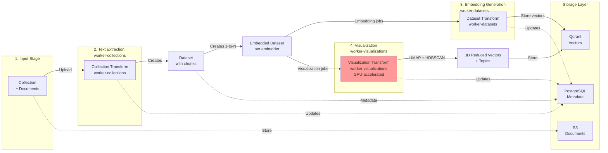
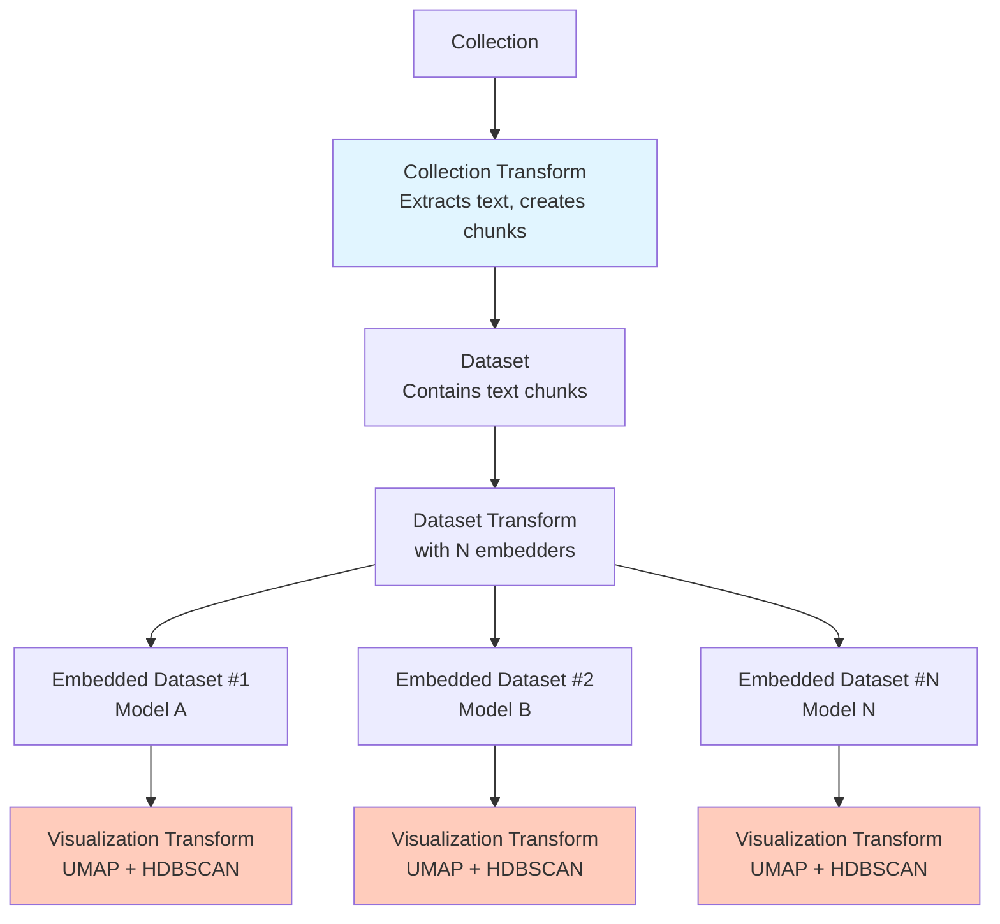

# Semantic Explorer

Semantic Explorer enables you to upload documents, extract and process their content, generate vector embeddings, perform semantic search and topic modeling across your document collections.

## Features

- 📄 **Multi-format Document Processing** - Extract text from PDF, Microsoft Office, OpenDocument, HTML, XML, and plain text files
- 🔍 **Semantic Search** - Vector similarity search powered by Qdrant with metadata filtering and side-by-side model comparison
- 📊 **Dataset Management** - Build structured datasets from processed documents with automatic chunking
- 🚀 **Async Job Processing** - Background workers handle document extraction, embedding generation, and visualization via NATS
- 🔐 **OpenID Connect Authentication** - Secure user authentication with OIDC integration
- 🎯 **Specialized Transform Pipelines** - Collection, Dataset, and Visualization transforms for each stage of processing
- 🎨 **3D Visualizations** - GPU-accelerated UMAP + HDBSCAN for exploring embedding spaces (requires NVIDIA GPU)
- 📈 **Full Observability** - OpenTelemetry tracing, Prometheus metrics, and Grafana dashboards
- 🗄️ **S3-compatible Storage** - Store documents in any S3-compatible object storage
- 🎨 **Modern UI** - Clean Svelte-based interface for managing collections, datasets, embeddings, and visualizations

## Architecture

Semantic Explorer follows a 3-tier architecture:

1. **API Layer** - REST API built with Actix-web, handles HTTP requests and authentication
2. **Storage Layer** - PostgreSQL for metadata, S3 for files, Qdrant for vector embeddings
3. **Worker Layer** - Async job processors for document extraction, embedding generation, and visualization

### Data Flow

The system implements a four-stage data processing pipeline with specialized workers:



**Note on Embedded Datasets**: When you create a Dataset Transform with multiple embedders, the system automatically creates one `Embedded Dataset` per embedder. Each embedded dataset tracks the embedding progress separately and can trigger its own visualization job.

### Usage Flow

#### Collections
Start by creating a collection and uploading your documents. Organize your content for processing.

#### Embedders
Configure your embedding providers (OpenAI, Cohere, etc.) that will be used to generate vector embeddings.

#### Collection Transform
Create a collection transform to extract text from your documents and generate chunks. This automatically populates a new Dataset with the processed content.

#### Datasets
Review the generated dataset containing your processed text chunks ready for embedding.

#### Dataset Transform
Create a dataset transform to generate embeddings using your configured embedders. The system creates one Embedded Dataset per embedder, enabling you to compare multiple embedding models.

#### Embedded Datasets
View the embedding progress for each model. As embeddings complete, you can search across them or trigger visualizations.

#### Search
Execute searches across multiple embedded datasets to compare embedding model performance side-by-side.

#### Visualization Transform
Create a visualization transform to reduce your embeddings to 3D using UMAP and identify topic clusters with HDBSCAN. Requires GPU support (CUDA 12.4).

## Quick Start

### Prerequisites

- Rust 1.83+ (2024 edition)
- Docker and Docker Compose
- Node.js 18+ (for UI development)

You will also need to generate OIDC credentials. 
You can use the included Dex server with external authentication providers such as Github.

In [dex.yaml](deployment/compose/dex.yaml), you can see both environment variables that are required (GITHUB_CLIENT_ID, GITHUB_CLIENT_SECRET) and example redirect URIs for local development.

If you create a personal Github Organization, you can create an OAuth App in the organization settings to get client ID and secret.

### Run with Docker Compose

The fastest way to get started is using the included Docker Compose stack:

```bash
cd deployment/compose # uses prebuilt images for API and workers
docker compose up -d
```

or

```bash
cd deployment/compose
docker compose -f compose.dev.yaml  up -d   # builds local binaries for API and workers
```

This starts:
- API server (port 8080)
- PostgreSQL database
- Qdrant vector database
- NATS message queue
- Rustfs (S3-compatible storage)
- Dex OIDC provider
- OpenTelemetry Collector
- Prometheus & Grafana
- Quickwit (log and trace aggregation)

Access the application at [http://localhost:8080](http://localhost:8080)

### Development Setup

1. **Clone the repository**
   ```bash
   git clone https://github.com/FishySoftware/semantic-explorer.git
   cd semantic-explorer
   ```

2. **Start infrastructure services**
   ```bash
   docker compose -f deployment/compose/compose.yaml up -d postgres nats qdrant rustfs dex
   ```

3. **Set environment variables**
   ```bash
   cp .env.example .env
   # Edit .env with your configuration
   ```

4. **Start the API server**
   ```bash
   cargo run --bin api
   ```

5. **Start background workers**
   ```bash
   # In separate terminals
   cargo run --bin worker-collections
   cargo run --bin worker-datasets
   cargo run --bin worker-visualizations  # Optional: requires NVIDIA GPU with CUDA 12.4
   ```

6. **Start the UI (optional)**
   ```bash
   cd semantic-explorer-ui
   npm install

   npm run dev
   or
   npm run build-watch
   ```

Alternatively, you can launch [Tasks](.vscode/tasks.json) in VSCode:
- Run API
- Run worker-collections
- Run worker-datasets
- Run worker-visualizations (optional, requires GPU)
- Run UI 

## Configuration

Semantic Explorer is configured via environment variables. 

Each service requires different configuration based on its responsibilities.

### API Service

The API service handles HTTP requests, authentication, and coordinates the system.

| Variable | Description | Required | Default |
|----------|-------------|----------|---------|
| `DATABASE_URL` | PostgreSQL connection string | Yes | - |
| `NATS_URL` | NATS server URL for job queue | Yes | `nats://localhost:4222` |
| `QDRANT_URL` | Qdrant vector database URL | Yes | `http://localhost:6334` |
| `AWS_ENDPOINT_URL` | S3-compatible storage endpoint | Yes | - |
| `AWS_ACCESS_KEY_ID` | S3 access key | Yes | - |
| `AWS_SECRET_ACCESS_KEY` | S3 secret key | Yes | - |
| `AWS_REGION` | AWS region | Yes | `us-east-1` |
| `OIDC_ISSUER_URL` | OpenID Connect issuer URL | Yes | - |
| `OIDC_CLIENT_ID` | OIDC client ID | Yes | - |
| `OIDC_CLIENT_SECRET` | OIDC client secret | Yes | - |
| `OIDC_USE_PKCE` | Enable PKCE for OIDC flow | No | `false` |
| `OTEL_EXPORTER_OTLP_ENDPOINT` | OpenTelemetry collector endpoint | No | - |
| `SERVICE_NAME` | Service name for telemetry | No | `semantic-explorer` |
| `HOSTNAME` | Hostname for server binding | No | `localhost` |
| `PORT` | API server port | No | `8080` |
| `STATIC_FILES_DIR` | Path to UI static files | No | `./semantic-explorer-ui/` |
| `RUST_LOG` | Logging configuration | No | `info` |

### Worker Collections

The collections worker handles document extraction and text processing jobs.

| Variable | Description | Required | Default |
|----------|-------------|----------|---------|
| `NATS_URL` | NATS server URL for job queue | Yes | `nats://localhost:4222` |
| `AWS_ENDPOINT_URL` | S3-compatible storage endpoint | Yes | - |
| `AWS_ACCESS_KEY_ID` | S3 access key | Yes | - |
| `AWS_SECRET_ACCESS_KEY` | S3 secret key | Yes | - |
| `AWS_REGION` | AWS region | Yes | `us-east-1` |
| `OTEL_EXPORTER_OTLP_ENDPOINT` | OpenTelemetry collector endpoint | No | - |
| `SERVICE_NAME` | Service name for telemetry | No | `worker-collections` |
| `RUST_LOG` | Logging configuration | No | `info` |

### Worker Datasets

The datasets worker handles embedding generation and vector storage jobs.

| Variable | Description | Required | Default |
|----------|-------------|----------|---------|
| `NATS_URL` | NATS server URL for job queue | Yes | `nats://localhost:4222` |
| `QDRANT_URL` | Qdrant vector database URL | Yes | `http://localhost:6334` |
| `AWS_ENDPOINT_URL` | S3-compatible storage endpoint | Yes | - |
| `AWS_ACCESS_KEY_ID` | S3 access key | Yes | - |
| `AWS_SECRET_ACCESS_KEY` | S3 secret key | Yes | - |
| `AWS_REGION` | AWS region | Yes | `us-east-1` |
| `OTEL_EXPORTER_OTLP_ENDPOINT` | OpenTelemetry collector endpoint | No | - |
| `SERVICE_NAME` | Service name for telemetry | No | `worker-datasets` |
| `RUST_LOG` | Logging configuration | No | `info` |

### Worker Visualizations

The visualizations worker handles GPU-accelerated dimensionality reduction and clustering for 3D visualizations.

**Requirements**: NVIDIA GPU with CUDA 12.4 support. See [crates/worker-visualizations/README.md](crates/worker-visualizations/README.md) for detailed setup instructions.

| Variable | Description | Required | Default |
|----------|-------------|----------|---------|
| `NATS_URL` | NATS server URL for job queue | Yes | `nats://localhost:4222` |
| `QDRANT_URL` | Qdrant vector database URL | Yes | `http://localhost:6334` |
| `OTEL_EXPORTER_OTLP_ENDPOINT` | OpenTelemetry collector endpoint | No | - |
| `SERVICE_NAME` | Service name for telemetry | No | `worker-visualizations` |
| `RUST_LOG` | Logging configuration | No | `info` |

### Example Configurations

See the `.env` files in each service directory for working examples:
- [crates/api/.env](crates/api/.env) - API service configuration
- [crates/worker-collections/.env](crates/worker-collections/.env) - Collections worker configuration
- [crates/worker-datasets/.env](crates/worker-datasets/.env) - Datasets worker configuration
- [crates/worker-visualizations/.env](crates/worker-visualizations/.env) - Visualizations worker configuration


## API Documentation

Interactive API documentation is available via Swagger UI at:

```
http://localhost:8080/swagger-ui/
```

## Development

### Project Structure

```
semantic-explorer/
├── crates/
│   ├── api/                      # Main REST API server
│   ├── core/                     # Shared libraries (jobs, NATS, storage)
│   ├── worker-collections/       # Document extraction worker
│   ├── worker-datasets/          # Embedding generation worker
│   └── worker-visualizations/    # GPU-accelerated visualization worker
├── semantic-explorer-ui/         # Svelte frontend
├── deployment/
│   ├── compose/               # Docker Compose deployment
│   └── helm/                  # Kubernetes Helm charts
└── .github/workflows/         # CI/CD pipelines
```

### Transform Architecture

The system uses a specialized transform model for each processing stage:



**Key Points**:
- **1-to-1 Relationship**: Collection → Collection Transform → Dataset
- **1-to-N Relationship**: Dataset Transform → Embedded Datasets (one per embedder)
- **1-to-1 Relationship**: Embedded Dataset → Visualization Transform
- **Automatic Creation**: Dataset Transforms automatically create Embedded Datasets for each configured embedder

### Running Tests

```bash
cargo test
```

### Code Quality

```bash
# Linting
cargo clippy -- -D warnings

# Formatting
cargo fmt --check

# Type checking
cargo check

# Detected unused dependencies
cargo machete

# Security auditing (RSA is problematic right now, pending fix.)
cargo audit
```

### Database Migrations

Migrations are located in `crates/api/migrations/` and are automatically applied on startup.

## Supported Document Formats

- **PDF** - `.pdf`
- **Microsoft Office** - `.doc`, `.docx`, `.xls`, `.xlsx`, `.ppt`, `.pptx`
- **OpenDocument** - `.odt`, `.ods`, `.odp`
- **Web** - `.html`, `.xml`
- **Text** - `.txt`, `.csv`

## Observability

### Metrics

Prometheus metrics are exposed at:
```
http://localhost:8080/metrics
```

### Tracing

OpenTelemetry traces are exported to the configured OTLP endpoint. View traces in Grafana or Jaeger.

### Logging

Logs are structured and exported via OpenTelemetry.

## Deployment

### Docker

Build and run with Docker:

```bash
cd deployment/compose
docker compose up -d
```

### Kubernetes

Deploy using Helm:

```bash
helm install semantic-explorer deployment/helm/semantic-explorer/
```

## Contributing
Open issues or pull requests on GitHub.

## License

Licensed under the Apache License, Version 2.0. See [LICENSE](LICENSE) for details.

## Author

Jonathan Poisson

---

For questions or issues, please open a GitHub issue.
