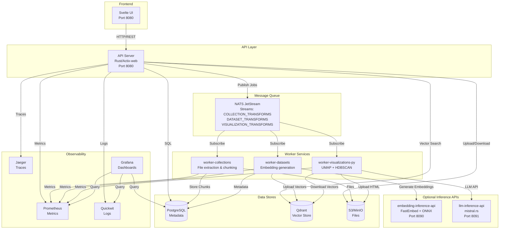
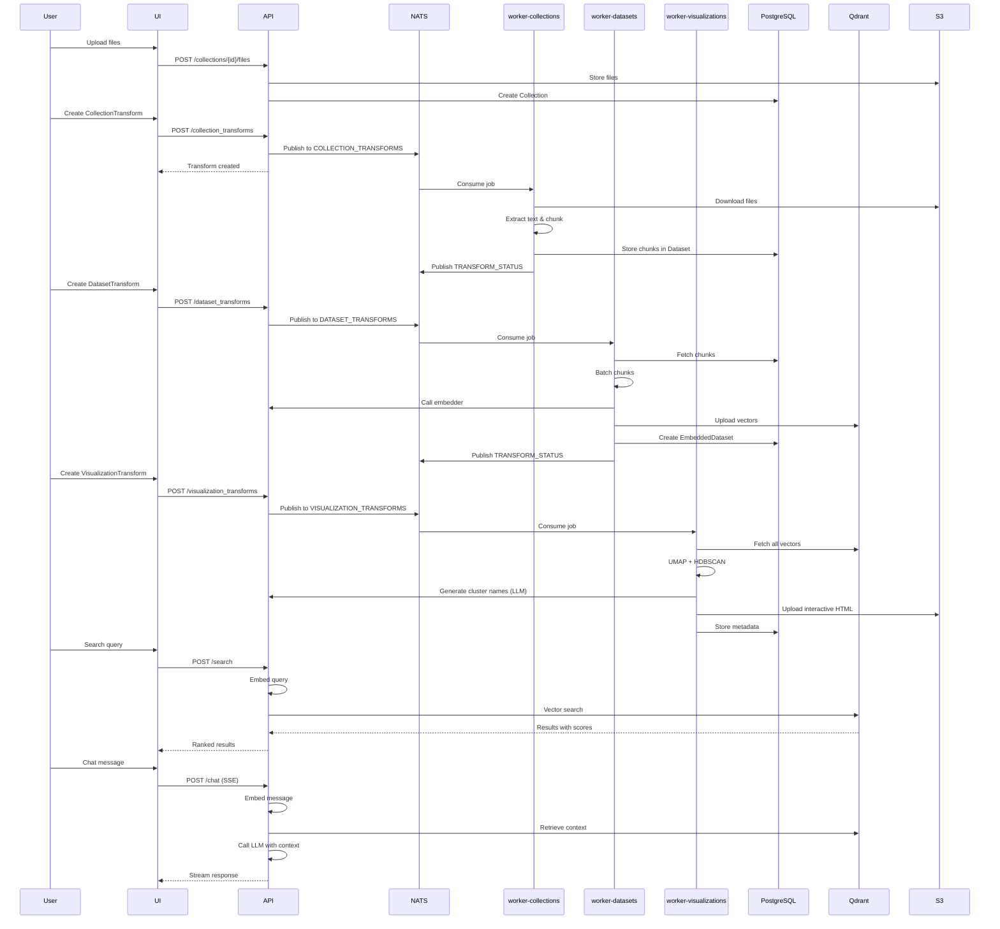

# Semantic Explorer


A platform for document processing, embedding generation, visualization, and semantic search with chat capabilities.

Process documents, generate vector embeddings, create interactive visualizations, and search across your data.

---

## ✨ Key Features

| Feature | Description |
|---------|-------------|
| **Multi-Format Processing** | Extract text from PDF, Office (docx/xlsx/pptx), legacy Office (doc/xls/ppt), OpenDocument, Markdown, HTML, XML, JSON, RTF, EPUB, email (eml/msg), log files, and archives (zip/tar/gz) |
| **Flexible Embeddings** | Local embedding via FastEmbed/ONNX, or cloud providers (OpenAI, Cohere) |
| **Vector Search** | Semantic similarity search across embedded datasets using Qdrant |
| **Interactive Visualizations** | UMAP dimensionality reduction with HDBSCAN clustering and LLM-generated topic labels |
| **Chat with Context** | Conversational interface with context retrieval and SSE streaming responses |
| **Quantized LLM Support** | Pre-quantized models (GGUF, GPTQ) for fast inference with reduced memory usage |
| **Production Observability** | OpenTelemetry metrics, distributed tracing, structured logging, Grafana dashboards |
| **Scalable Architecture** | Microservices with NATS JetStream, PostgreSQL, and Qdrant vector database |

---

## 🏗️ Architecture



<details>
<summary><strong>📊 Data Flow Sequence</strong></summary>



</details>

---

## 📁 Project Structure

```
semantic-explorer/
├── crates/
│   ├── api/                          # Main API server (Rust)
│   ├── core/                         # Shared library & utilities (Rust)
│   ├── worker-collections/           # File extraction worker (Rust)
│   ├── worker-datasets/              # Embedding worker (Rust)
│   ├── worker-visualizations-py/     # Visualization worker (Python)
│   ├── embedding-inference-api/      # Local embedding server (Rust)
│   └── llm-inference-api/            # Local LLM server (Rust)
├── semantic-explorer-ui/             # Svelte frontend
├── deployment/
│   ├── compose/                      # Docker Compose configs
│   └── helm/                         # Kubernetes/Helm charts
└── README.md
```

### Component Documentation

| Component | Description | README |
|-----------|-------------|--------|
| **API Server** | REST API, authentication, search, chat | [crates/api/README.md](crates/api/README.md) |
| **Core Library** | Shared configuration, observability, NATS setup | [crates/core/README.md](crates/core/README.md) |
| **Collections Worker** | File extraction and chunking | [crates/worker-collections/README.md](crates/worker-collections/README.md) |
| **Datasets Worker** | Embedding generation | [crates/worker-datasets/README.md](crates/worker-datasets/README.md) |
| **Visualizations Worker** | UMAP/HDBSCAN processing | [crates/worker-visualizations-py/README.md](crates/worker-visualizations-py/README.md) |
| **Embedding Inference API** | Local embedding server (FastEmbed) | [crates/embedding-inference-api/README.md](crates/embedding-inference-api/README.md) |
| **LLM Inference API** | Local LLM server with quantization support (mistral.rs) | [crates/llm-inference-api/README.md](crates/llm-inference-api/README.md) |
| **Svelte UI** | Frontend application | [semantic-explorer-ui/README.md](semantic-explorer-ui/README.md) |

---

## 🚀 Quick Start

### Prerequisites

- **Docker & Docker Compose** v2.0+
- **NVIDIA GPU** (optional, for local inference)
- **Rust** 1.75+ (for development)
- **Python** 3.11+ (for visualization worker development)
- **Node.js** 20+ (for UI development)

### Development Stack

```bash
# Clone the repository
git clone https://github.com/FishySoftware/semantic-explorer.git
cd semantic-explorer

# Start all services
cd deployment/compose
docker compose -f compose.dev.yaml up -d

# Check service health
docker compose -f compose.dev.yaml ps

# View logs
docker compose -f compose.dev.yaml logs -f semantic-explorer

# Access the UI
open http://localhost:8080
```

The dev stack includes:
- API server + Svelte UI (port 8080)
- 3 worker services
- PostgreSQL, NATS (3-node cluster), Qdrant, MinIO (4-node cluster)
- Prometheus, Grafana, Jaeger, Quickwit (observability)
- Dex (OIDC provider for development)

### Production Deployment

```bash
cd deployment/compose
docker compose -f compose.yaml up -d
```

See [deployment/DEPLOYMENT_GUIDE.md](deployment/DEPLOYMENT_GUIDE.md) for detailed production configuration.

---

## ⚙️ Environment Variables Reference

All services are configured via environment variables. This is the **complete reference** for the entire platform.

<details>
<summary><strong>🔧 Server Configuration</strong></summary>

| Variable | Default | Required | Description |
|----------|---------|----------|-------------|
| `HOSTNAME` | `localhost` | No | Server bind address |
| `PORT` | `8080` | No | Server port |
| `PUBLIC_URL` | - | No | External URL for OIDC callbacks |
| `CORS_ALLOWED_ORIGINS` | - | No | Comma-separated allowed origins |
| `STATIC_FILES_DIR` | `./semantic-explorer-ui/` | No | Path to static UI files |
| `SHUTDOWN_TIMEOUT_SECS` | - | No | Graceful shutdown timeout |

</details>

<details>
<summary><strong>🗄️ Database (PostgreSQL)</strong></summary>

| Variable | Default | Required | Description |
|----------|---------|----------|-------------|
| `DATABASE_URL` | - | **Yes** | PostgreSQL connection string |
| `DB_MAX_CONNECTIONS` | `15` | No | Maximum pool connections |
| `DB_MIN_CONNECTIONS` | `2` | No | Minimum pool connections |
| `DB_ACQUIRE_TIMEOUT_SECS` | `30` | No | Connection acquire timeout |
| `DB_IDLE_TIMEOUT_SECS` | `300` | No | Idle connection timeout |
| `DB_MAX_LIFETIME_SECS` | `1800` | No | Maximum connection lifetime |

</details>

<details>
<summary><strong>📨 NATS JetStream</strong></summary>

| Variable | Default | Required | Description |
|----------|---------|----------|-------------|
| `NATS_URL` | `nats://localhost:4222` | No | NATS server URL |
| `NATS_REPLICAS` | `3` | No | Stream replica count |

</details>

<details>
<summary><strong>🔍 Qdrant Vector Database</strong></summary>

| Variable | Default | Required | Description |
|----------|---------|----------|-------------|
| `QDRANT_URL` | `http://localhost:6334` | No | Qdrant gRPC endpoint |
| `QDRANT_API_KEY` | - | No | API key for authentication |
| `QDRANT_TIMEOUT_SECS` | `30` | No | Request timeout |
| `QDRANT_CONNECT_TIMEOUT_SECS` | `10` | No | Connection timeout |
| `QDRANT_QUANTIZATION_TYPE` | `none` | No | `none`, `scalar`, or `product` |

</details>

<details>
<summary><strong>☁️ S3-Compatible Storage</strong></summary>

| Variable | Default | Required | Description |
|----------|---------|----------|-------------|
| `AWS_REGION` | - | **Yes** | AWS region |
| `AWS_ACCESS_KEY_ID` | - | No* | Access key (or use IAM roles) |
| `AWS_SECRET_ACCESS_KEY` | - | No* | Secret key (or use IAM roles) |
| `AWS_ENDPOINT_URL` | - | **Yes** | S3 endpoint (e.g., MinIO URL) |
| `S3_BUCKET_NAME` | - | **Yes** | Bucket name for all storage |
| `S3_MAX_DOWNLOAD_SIZE_BYTES` | `104857600` (100MB) | No | Max download size |
| `S3_MAX_UPLOAD_SIZE_BYTES` | `1073741824` (1GB) | No | Max upload size |

*Required unless using IAM roles/instance profiles

</details>

<details>
<summary><strong>🔐 Authentication (OIDC)</strong></summary>

| Variable | Default | Required | Description |
|----------|---------|----------|-------------|
| `OIDC_CLIENT_ID` | - | **Yes** | OIDC client identifier |
| `OIDC_CLIENT_SECRET` | - | **Yes** | OIDC client secret |
| `OIDC_ISSUER_URL` | - | **Yes** | OIDC issuer URL |
| `OIDC_USE_PKCE` | `false` | No | Enable PKCE flow |
| `OIDC_SESSION_MANAGEMENT_ENABLED` | `true` | No | Enable session management |
| `OIDC_SESSION_TIMEOUT_SECS` | `3600` | No | Session timeout (1 hour) |
| `OIDC_INACTIVITY_TIMEOUT_SECS` | `1800` | No | Inactivity timeout (30 min) |
| `OIDC_MAX_CONCURRENT_SESSIONS` | `5` | No | Max sessions per user |
| `OIDC_REFRESH_TOKEN_ROTATION_ENABLED` | `true` | No | Enable token rotation |

</details>

<details>
<summary><strong>🔒 Encryption & TLS</strong></summary>

| Variable | Default | Required | Description |
|----------|---------|----------|-------------|
| `ENCRYPTION_MASTER_KEY` | - | **Yes** | 32-byte hex key for AES-256-GCM |
| `SERVER_SSL_ENABLED` | `false` | No | Enable HTTPS |
| `TLS_SERVER_CERT_PATH` | - | If SSL | Path to server certificate |
| `TLS_SERVER_KEY_PATH` | - | If SSL | Path to server private key |
| `CLIENT_MTLS_ENABLED` | `false` | No | Enable mutual TLS for clients |
| `TLS_CLIENT_CERT_PATH` | - | If mTLS | Path to client certificate |
| `TLS_CLIENT_KEY_PATH` | - | If mTLS | Path to client private key |
| `TLS_CA_CERT_PATH` | - | No | CA bundle path (uses system if unset) |

</details>

<details>
<summary><strong>📊 Observability</strong></summary>

| Variable | Default | Required | Description |
|----------|---------|----------|-------------|
| `SERVICE_NAME` | `semantic-explorer` | No | Service name for telemetry |
| `OTEL_EXPORTER_OTLP_ENDPOINT` | `http://localhost:4317` | No | OTLP collector endpoint |
| `LOG_FORMAT` | `json` | No | `json` or `pretty` |
| `RUST_LOG` | - | No | Rust log filter (e.g., `info,semantic_explorer=debug`) |
| `LOG_LEVEL` | `INFO` | No | Python log level |

</details>

<details>
<summary><strong>🧠 Inference APIs</strong></summary>

| Variable | Default | Required | Description |
|----------|---------|----------|-------------|
| `EMBEDDING_INFERENCE_API_URL` | `http://localhost:8090` | No | Local embedding API URL |
| `EMBEDDING_INFERENCE_API_TIMEOUT_SECS` | `120` | No | Request timeout |
| `LLM_INFERENCE_API_URL` | `http://localhost:8091` | No | Local LLM API URL |
| `LLM_INFERENCE_API_TIMEOUT_SECS` | `120` | No | Request timeout |

**Embedding Inference API specific:**

| Variable | Default | Required | Description |
|----------|---------|----------|-------------|
| `INFERENCE_HOSTNAME` | `0.0.0.0` | No | Server bind address |
| `INFERENCE_PORT` | `8090` | No | Server port |
| `INFERENCE_ALLOWED_EMBEDDING_MODELS` | - | **Yes** | Comma-separated model list |
| `INFERENCE_ALLOWED_RERANK_MODELS` | - | No | Comma-separated reranker list |
| `INFERENCE_MAX_BATCH_SIZE` | `256` | No | Max batch size |
| `INFERENCE_MAX_CONCURRENT_REQUESTS` | `2` | No | Concurrent request limit |
| `HF_HOME` | `/models` | No | HuggingFace cache directory |

**LLM Inference API specific:**

| Variable | Default | Required | Description |
|----------|---------|----------|-------------|
| `LLM_INFERENCE_HOSTNAME` | `0.0.0.0` | No | Server bind address |
| `LLM_INFERENCE_PORT` | `8091` | No | Server port |
| `LLM_ALLOWED_MODELS` | - | **Yes** | Comma-separated model list or `*` for all |
| `LLM_MAX_CONCURRENT_REQUESTS` | `2` | No | Concurrent request limit |
| `LLM_DEFAULT_TEMPERATURE` | `0.7` | No | Default sampling temperature |
| `LLM_DEFAULT_TOP_P` | `0.9` | No | Default top-p sampling |
| `LLM_DEFAULT_MAX_TOKENS` | `512` | No | Default max tokens |
| `LLM_MAX_TOKENS_LIMIT` | `4096` | No | Maximum allowed tokens |
| `LLM_ENABLE_ISQ` | `false` | No | Enable runtime quantization (slow, not cached) |
| `LLM_ISQ_TYPE` | - | No | ISQ quantization type (Q4_K, Q8_0, etc.) |
| `HF_HOME` | `/models` | No | HuggingFace cache directory |
| `HF_ENDPOINT` | - | No | HuggingFace mirror URL |

> 💡 **Tip**: Use pre-quantized GGUF models (e.g., `TheBloke/Mistral-7B-Instruct-v0.2-GGUF`) for fast loading. See [crates/llm-inference-api/QUANTIZATION.md](crates/llm-inference-api/QUANTIZATION.md) for details.

</details>

<details>
<summary><strong>👷 Worker Configuration</strong></summary>

| Variable | Default | Required | Description |
|----------|---------|----------|-------------|
| `MAX_CONCURRENT_JOBS` | `10` | No | Concurrent jobs per worker |
| `PROCESSING_TIMEOUT_SECS` | `3600` | No | Job timeout |
| `WORKER_ID` | UUID | No | Unique worker identifier |
| `NATS_STREAM_RETRY_ATTEMPTS` | `30` | No | Stream connection retries |
| `NATS_STREAM_RETRY_DELAY` | `2.0` | No | Retry delay in seconds |
| `NATS_BATCH_SIZE` | `1` | No | Messages per fetch |
| `NATS_FETCH_TIMEOUT` | `5.0` | No | Fetch timeout in seconds |
| `PROMETHEUS_METRICS_PORT` | `9090` | No | Metrics endpoint port |

</details>

---

## 🔧 Building from Source

### Rust Crates

#### Standard Build (CPU-only)

```bash
# Debug build
cargo build

# Release build (optimized)
cargo build --release

# Build specific crate
cargo build -p semantic-explorer
cargo build -p worker-collections
```

#### CUDA Build (GPU acceleration for inference APIs)

For systems with NVIDIA GPUs, the inference APIs support CUDA acceleration:

```bash
# 1. One-time setup (downloads ONNX Runtime with CUDA support)
./setup_cuda.sh

# 2. Build with CUDA support
./cargo_cuda.sh build --release

# Or build specific inference APIs
./cargo_cuda.sh build -p embedding-inference-api --release
./cargo_cuda.sh build -p llm-inference-api --release
```

The `cargo_cuda.sh` wrapper:
- Automatically detects and configures CUDA environments
- Works for the entire workspace
- Falls back to CPU-only build if CUDA not available
- Can be used for any cargo command: `./cargo_cuda.sh test`, `./cargo_cuda.sh clippy`, etc.

**Requirements:**
- NVIDIA GPU with CUDA 12.x drivers
- `nvidia-smi` command available
- Sufficient disk space (~500MB for ONNX Runtime)

### UI

```bash
cd semantic-explorer-ui
npm install
npm run build
```

### Docker Images

```bash
# API server
docker build -f crates/api/Dockerfile -t semantic-explorer:latest .

# Workers
docker build -f crates/worker-collections/Dockerfile -t worker-collections:latest .
docker build -f crates/worker-datasets/Dockerfile -t worker-datasets:latest .
docker build -f crates/worker-visualizations-py/Dockerfile -t worker-visualizations-py:latest .

# Inference APIs (requires CUDA)
docker build -f crates/embedding-inference-api/Dockerfile -t embedding-inference-api:latest .
docker build -f crates/llm-inference-api/Dockerfile -t llm-inference-api:latest .
```

---

## 🧪 Testing

```bash
# Run all Rust tests
cargo test

# Run tests for specific crate
cargo test -p semantic-explorer-core

# With logging
RUST_LOG=debug cargo test -- --nocapture

# Python tests
cd crates/worker-visualizations-py
python -m pytest tests/

# UI tests
cd semantic-explorer-ui
npm test
```

---

## 📈 Observability

### Endpoints

| Service | Metrics | Health |
|---------|---------|--------|
| API Server | `:8080/metrics` | `:8080/health/live`, `:8080/health/ready` |
| Embedding API | `:8090/metrics` | `:8090/health/live`, `:8090/health/ready` |
| LLM API | `:8091/metrics` | `:8091/health/live`, `:8091/health/ready` |
| Viz Worker | `:9093/metrics` | - |

### Dashboards (Dev Stack)

| Service | URL |
|---------|-----|
| **Grafana** | http://localhost:3000 (admin/admin) |
| **Prometheus** | http://localhost:9090 |
| **Jaeger** | http://localhost:16686 |
| **Quickwit** | http://localhost:7280 |

### Metrics Categories

- **HTTP**: Request count, duration, status codes (`http_requests_total`, `http_request_duration_seconds`)
- **Database**: Query duration, connection pool stats
- **Workers**: Job count, duration, success/failure rates
- **Search**: Query latency, embedder performance
- **NATS**: Message backlog, consumer lag

---

## 📚 API Documentation

Interactive OpenAPI/Swagger UI available at:

```
http://localhost:8080/swagger-ui
```

### Key Endpoints

| Method | Endpoint | Description |
|--------|----------|-------------|
| `POST` | `/api/collections` | Create collection |
| `POST` | `/api/collections/{id}/files` | Upload files |
| `POST` | `/api/collection_transforms` | Start extraction job |
| `POST` | `/api/dataset_transforms` | Start embedding job |
| `POST` | `/api/visualization_transforms` | Create visualization |
| `POST` | `/api/search` | Vector search |
| `POST` | `/api/chat` | Chat with context (SSE streaming) |
| `GET` | `/health/ready` | Readiness probe |
| `GET` | `/health/live` | Liveness probe |

---

## 🔐 Security

### Authentication

OIDC (OpenID Connect) authentication with any compliant provider:

```bash
OIDC_ISSUER_URL=https://your-idp.example.com
OIDC_CLIENT_ID=semantic-explorer
OIDC_CLIENT_SECRET=your-secret
```

Development includes Dex OIDC provider for testing.

### Encryption

- **Secrets**: AES-256-GCM encryption for API keys stored in database
- **TLS**: HTTPS support with custom certificates
- **mTLS**: Mutual TLS for service-to-service communication

### Audit Logging

All API actions logged to PostgreSQL `audit_events` table:
- User identity (OIDC subject)
- Action type (CREATE, UPDATE, DELETE)
- Resource type and ID
- Timestamp and IP address

---

## 🐛 Troubleshooting

<details>
<summary><strong>Worker not processing jobs</strong></summary>

```bash
# Check NATS stream status
docker exec -it nats-1 nats stream ls
docker exec -it nats-1 nats consumer ls COLLECTION_TRANSFORMS

# Check worker logs
docker logs worker-collections -f
```

</details>

<details>
<summary><strong>Embedding failures</strong></summary>

```bash
# Check embedder configuration
curl http://localhost:8080/api/embedders

# Test embedding API directly
curl -X POST http://localhost:8090/api/embed \
  -H "Content-Type: application/json" \
  -d '{"input": ["test text"], "model": "sentence-transformers/all-MiniLM-L6-v2"}'
```

</details>

<details>
<summary><strong>Search returning no results</strong></summary>

```bash
# Check Qdrant collections
curl http://localhost:6333/collections

# Check embedded dataset status
curl http://localhost:8080/api/embedded_datasets
```

</details>

<details>
<summary><strong>Debug logging</strong></summary>

```bash
# Rust services
RUST_LOG=debug,semantic_explorer=trace

# Python worker
LOG_LEVEL=DEBUG
```

</details>

---

## 🤝 Contributing

1. Fork the repository
2. Create a feature branch (`git checkout -b feature/amazing-feature`)
3. Run formatting and linting:
   ```bash
   cargo fmt && cargo clippy
   cd semantic-explorer-ui && npm run format && npm run lint
   ```
4. Commit your changes
5. Push and open a Pull Request

---

## 📄 License

Apache License 2.0 - See [LICENSE](LICENSE) for details.

---

## 🙏 Acknowledgments

Built with:
- [Actix-web](https://actix.rs/) - Rust web framework
- [FastEmbed](https://github.com/Anush008/fastembed-rs) - Fast embedding library
- [mistral.rs](https://github.com/EricLBuehler/mistral.rs) - LLM inference engine
- [UMAP](https://umap-learn.readthedocs.io/) - Dimensionality reduction
- [HDBSCAN](https://hdbscan.readthedocs.io/) - Clustering algorithm
- [Qdrant](https://qdrant.tech/) - Vector database
- [NATS](https://nats.io/) - Message queue
- [Svelte](https://svelte.dev/) - Frontend framework
- [OpenTelemetry](https://opentelemetry.io/) - Observability framework
