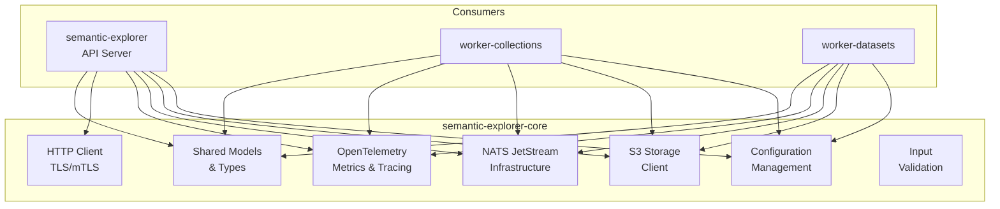
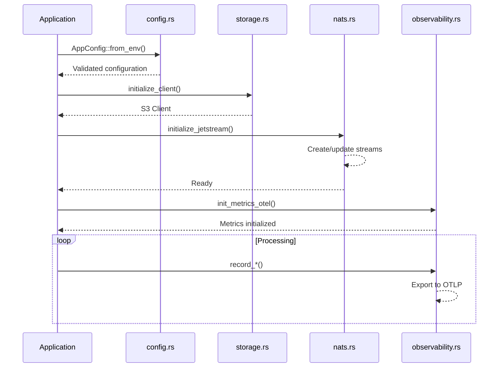

# Core Library - Shared Utilities for Semantic Explorer

Shared library providing core functionality used across all Semantic Explorer services including configuration, encryption, HTTP client, database access, message queue integration, and worker patterns.

## 📋 Overview

The `semantic-explorer-core` crate is a library that provides foundational utilities for all other crates:

### Key Modules
- **`config.rs`** - Configuration management from environment variables
- **`encryption.rs`** - AES-256 encryption/decryption for sensitive data
- **`http_client.rs`** - Shared HTTP client with retry logic and timeouts
- **`models.rs`** - Core domain models and types (jobs include parent IDs for hierarchical status)
- **`nats.rs`** - NATS JetStream client for pub/sub and streaming
- **`observability.rs`** - OpenTelemetry setup for tracing
- **`secrets.rs`** - Secure `SecretString` wrapper for sensitive data handling
- **`storage.rs`** - S3-compatible file storage client
- **`subjects.rs`** - NATS subject constants and status subject builders for worker communication
- **`validation.rs`** - Input validation and sanitization
- **`worker.rs`** - Worker patterns for async job processing
- **`lib.rs`** - Module exports and public API

## 🏗️ Architecture



## Module Structure

| Module | Description |
|--------|-------------|
| `config` | Environment-based configuration loading with fail-fast validation |
| `storage` | AWS S3 client initialization and file operations |
| `nats` | JetStream stream/consumer setup and configuration |
| `encryption` | AES-256-GCM encryption for API keys and secrets at rest |
| `secrets` | Secure handling of sensitive data with `SecretString` wrapper type |
| `subjects` | NATS subject constants and status subject builders for worker communication |
| `worker` | Generic worker framework for background job processing |
| `observability` | OpenTelemetry metrics definitions and recording functions |
| `http_client` | Shared HTTP client with TLS certificate support |
| `models` | Domain models for jobs (with parent IDs), transforms, and embedder configurations |
| `validation` | Input validation utilities and error types |

## Technologies

| Technology | Version | Purpose |
|------------|---------|---------|
| Rust | 2024 Edition | Language |
| tokio | 1.49 | Async runtime |
| aws-sdk-s3 | 1.119 | S3-compatible storage |
| async-nats | 0.45 | NATS messaging |
| opentelemetry | 0.31 | Distributed tracing & metrics |
| reqwest | 0.13 | HTTP client |
| serde | 1.0 | Serialization |
| aes-gcm | 0.10 | Encryption |

## Data Flow



## Environment Variables

### Database Configuration

| Variable | Type | Default | Description |
|----------|------|---------|-------------|
| `DATABASE_URL` | string | **required** | PostgreSQL connection string |
| `DB_MAX_CONNECTIONS` | integer | `50` | Maximum connection pool size |
| `DB_MIN_CONNECTIONS` | integer | `2` | Minimum connection pool size |
| `DB_ACQUIRE_TIMEOUT_SECS` | integer | `30` | Connection acquisition timeout |
| `DB_IDLE_TIMEOUT_SECS` | integer | `300` | Idle connection timeout |
| `DB_MAX_LIFETIME_SECS` | integer | `1800` | Maximum connection lifetime |

### NATS Configuration

| Variable | Type | Default | Description |
|----------|------|---------|-------------|
| `NATS_URL` | string | `nats://localhost:4222` | NATS server URL |
| `NATS_REPLICAS` | integer | `3` | Number of replicas for JetStream streams (production) |

### Encryption Configuration

**IMPORTANT**: API keys and secrets are encrypted at rest using AES-256-GCM encryption. The master encryption key must be securely generated and stored.

| Variable | Type | Default | Description |
|----------|------|---------|-------------|
| `ENCRYPTION_MASTER_KEY` | string | **required** | 256-bit encryption key as hex string (64 hex characters) |

#### Encryption Setup

1. **Generate a master key** (do this once and store securely):
   ```bash
   openssl rand -hex 32
   # Output: a1b2c3d4e5f6a7b8c9d0e1f2a3b4c5d6e7f8a9b0c1d2e3f4a5b6c7d8e9f0a
   ```

2. **Configure in production**:
   ```bash
   # Store the key in a secrets management system (Vault, AWS Secrets Manager, etc.)
   # and inject it as an environment variable
   export ENCRYPTION_MASTER_KEY="a1b2c3d4e5f6a7b8c9d0e1f2a3b4c5d6e7f8a9b0c1d2e3f4a5b6c7d8e9f0a"
   ```

3. **Encryption Format**: API keys are encrypted using AES-256-GCM with:
   - **Key**: 256-bit master key from `ENCRYPTION_MASTER_KEY`
   - **Nonce**: 96-bit random value (12 bytes), generated per encryption
   - **Format**: base64(`nonce || ciphertext`) where `||` is concatenation
   - **Storage**: Encrypted value stored in database column `api_key_encrypted`

4. **Decryption Flow**:
   ```
   Retrieve encrypted value from database
   → Base64 decode → Extract 12-byte nonce from beginning
   → Decrypt remaining bytes using master key and nonce
   → Result is plaintext API key
   ```

#### Key Rotation

To rotate the master key:
1. Generate a new key with `openssl rand -hex 32`
2. Create a migration that re-encrypts all stored secrets with the new key
3. Update the environment variable to the new key
4. Run the migration
5. Store the old key securely for backup/recovery purposes

### Qdrant Configuration

| Variable | Type | Default | Description |
|----------|------|---------|-------------|
| `QDRANT_URL` | string | `http://localhost:6334` | Qdrant server URL |
| `QDRANT_API_KEY` | string | *optional* | Qdrant API key |
| `QDRANT_TIMEOUT_SECS` | integer | `30` | Request timeout |
| `QDRANT_CONNECT_TIMEOUT_SECS` | integer | `10` | Connection timeout |

### S3 Storage Configuration

| Variable | Type | Default | Description |
|----------|------|---------|-------------|
| `AWS_REGION` | string | **required** | AWS region |
| `AWS_ACCESS_KEY_ID` | string | **required** | AWS access key |
| `AWS_SECRET_ACCESS_KEY` | string | **required** | AWS secret key |
| `AWS_ENDPOINT_URL` | string | **required** | S3-compatible endpoint URL |
| `MAX_FILE_SIZE_MB` | integer | `100` | Maximum file size for in-memory processing (MB) |

### Server Configuration

| Variable | Type | Default | Description |
|----------|------|---------|-------------|
| `HOSTNAME` | string | `localhost` | Server bind address |
| `PORT` | integer | `8080` | Server port |
| `STATIC_FILES_DIR` | string | `./semantic-explorer-ui/` | UI static files directory |
| `CORS_ALLOWED_ORIGINS` | string | *empty* | Comma-separated CORS origins |
| `SHUTDOWN_TIMEOUT_SECS` | integer | `30` | Graceful shutdown timeout |

### Observability Configuration

| Variable | Type | Default | Description |
|----------|------|---------|-------------|
| `SERVICE_NAME` | string | `semantic-explorer` | Service name for tracing |
| `OTEL_EXPORTER_OTLP_ENDPOINT` | string | `http://localhost:4317` | OTLP exporter endpoint |
| `LOG_FORMAT` | string | `json` | Log format (`json` or `pretty`) |
| `RUST_LOG` | string | `info` | Tracing filter directive |

### TLS Configuration

| Variable | Type | Default | Description |
|----------|------|---------|-------------|
| `SERVER_SSL_ENABLED` | boolean | `false` | Enable server TLS |
| `TLS_SERVER_CERT_PATH` | string | *conditional* | Server certificate path (required if SSL enabled) |
| `TLS_SERVER_KEY_PATH` | string | *conditional* | Server private key path (required if SSL enabled) |
| `CLIENT_MTLS_ENABLED` | boolean | `false` | Enable client mTLS |
| `TLS_CLIENT_CERT_PATH` | string | *conditional* | Client certificate path (required if mTLS enabled) |
| `TLS_CLIENT_KEY_PATH` | string | *conditional* | Client private key path (required if mTLS enabled) |
| `TLS_CA_CERT_PATH` | string | `/app/certs/ca-bundle.crt` | CA certificate bundle path |

## Observability

### Metrics Exported

The crate exports the following OpenTelemetry metrics:

#### Database Metrics
- `database_query_total` - Counter of database queries by operation, table, status
- `database_query_duration_seconds` - Histogram of query durations
- `database_connection_pool_size` - Gauge of pool size
- `database_connection_pool_active` - Gauge of active connections
- `database_connection_pool_idle` - Gauge of idle connections

#### Storage Metrics
- `storage_operations_total` - Counter of S3 operations by type
- `storage_operation_duration_seconds` - Histogram of operation durations
- `storage_file_size_bytes` - Histogram of file sizes

#### Worker Metrics
- `worker_jobs_total` - Counter of jobs processed
- `worker_job_duration_seconds` - Histogram of job durations
- `worker_job_chunks` - Histogram of chunks per job
- `worker_job_file_size_bytes` - Histogram of file sizes
- `worker_job_failures_total` - Counter of job failures by error type
- `worker_job_retries_total` - Counter of job retries

#### Transform Metrics
- `collection_transform_jobs_total` - Collection transform jobs
- `collection_transform_files_processed` - Files processed
- `collection_transform_items_created` - Dataset items created
- `dataset_transform_jobs_total` - Dataset transform jobs
- `dataset_transform_batches_processed` - Batches processed
- `dataset_transform_chunks_embedded` - Chunks embedded
- `visualization_transform_jobs_total` - Visualization jobs
- `visualization_transform_points_created` - Points created
- `visualization_transform_clusters_created` - Clusters created

#### NATS Metrics
- `nats_stream_messages` - Messages in stream
- `nats_stream_bytes` - Stream size in bytes
- `nats_consumer_pending` - Pending consumer messages
- `nats_consumer_ack_pending` - Messages pending acknowledgement
- `nats_publish_duration_seconds` - Publish operation duration
- `nats_subscribe_latency_seconds` - Subscribe latency

#### Search Metrics
- `search_request_total` - Search requests
- `search_request_duration_seconds` - Total search duration
- `search_embedder_call_duration_seconds` - Embedder API call duration
- `search_qdrant_query_duration_seconds` - Qdrant query duration
- `search_results_returned` - Results per search

#### HTTP Metrics
- `http_requests_total` - HTTP requests by method, path, status
- `http_request_duration_seconds` - Request duration
- `http_requests_in_flight` - Current in-flight requests

#### SSE Metrics
- `sse_connections_active` - Active SSE connections
- `sse_messages_sent` - SSE messages sent
- `sse_connection_duration_seconds` - Connection duration

### Recording Metrics

```rust
use semantic_explorer_core::observability;

// Record a database query
observability::record_database_query("SELECT", "collections", duration, true);

// Record a storage operation
observability::record_storage_operation("upload", duration, Some(file_size), true);

// Record a worker job
observability::record_worker_job("transform-file", duration, "success");

// Update connection pool stats
observability::update_database_pool_stats(50, 10, 40);
```

## Usage Example

```rust
use semantic_explorer_core::config::AppConfig;
use semantic_explorer_core::storage::initialize_client;
use semantic_explorer_core::nats::initialize_jetstream;
use semantic_explorer_core::observability;

#[tokio::main]
async fn main() -> anyhow::Result<()> {
    // Load configuration (fails fast if required vars missing)
    let config = AppConfig::from_env()?;

    // Initialize S3 client
    let s3_client = initialize_client().await?;

    // Initialize NATS JetStream
    let nats_client = async_nats::connect(&config.nats.url).await?;
    initialize_jetstream(&nats_client).await?;

    // Initialize metrics
    observability::init_metrics_otel()?;

    // Your application logic...

    Ok(())
}
```

## Encryption Module

The `encryption` module provides AES-256-GCM authenticated encryption for sensitive data like API keys and credentials.

### Core Features

- **Algorithm**: AES-256-GCM (authenticated encryption with associated data)
- **Key Derivation**: Master key from `ENCRYPTION_MASTER_KEY` environment variable
- **Nonce**: 96-bit (12-byte) random value per encryption operation
- **Authentication**: Built-in GCM authentication tag prevents tampering
- **Storage**: Encrypted data as base64 string: `base64(nonce || ciphertext)`

### Usage Example

```rust
use semantic_explorer_core::encryption::EncryptionService;

#[tokio::main]
async fn main() -> anyhow::Result<()> {
    // Initialize from environment (requires ENCRYPTION_MASTER_KEY)
    let encryption = EncryptionService::from_env()?;

    // Encrypt a secret
    let plaintext_key = "sk-1234567890abcdef";
    let encrypted = encryption.encrypt(plaintext_key)?;
    println!("Encrypted: {}", encrypted);

    // Decrypt the secret
    let decrypted = encryption.decrypt(&encrypted)?;
    assert_eq!(plaintext_key, decrypted);

    // Check if a string looks encrypted
    if encryption.is_encrypted(&encrypted) {
        println!("Data appears to be encrypted");
    }

    Ok(())
}
```

### Key Generation

Generate a new 256-bit master key:

```bash
# Generate hex-encoded 32-byte key
openssl rand -hex 32

# Example output (use this as ENCRYPTION_MASTER_KEY):
# a1b2c3d4e5f6a7b8c9d0e1f2a3b4c5d6e7f8a9b0c1d2e3f4a5b6c7d8e9f0a
```

### API Encryption in Practice

When a user provides an API key (e.g., OpenAI key):

```
User Input: "sk-proj-abc123..."
           ↓
    Encryption Service
           ↓
    Encrypted (base64): "KRaXxK3l2F8=<ciphertext>..."
           ↓
    Store in database column: api_key_encrypted
```

When the API key is needed:

```
Load from database: "KRaXxK3l2F8=<ciphertext>..."
           ↓
    Decryption Service
           ↓
    Plaintext: "sk-proj-abc123..."
           ↓
    Use with external API (OpenAI, Cohere, etc.)
```

### Security Considerations

1. **Master Key Storage**: Store in secure secret management system (Vault, AWS Secrets Manager, HashiCorp Vault)
2. **Key Rotation**: Implement database migration to re-encrypt with new key
3. **Nonce Handling**: Each encryption generates a unique random nonce (re-encrypting same secret produces different ciphertext)
4. **Authentication**: GCM provides authenticated encryption - tampering detected automatically
5. **No Direct Access**: API keys never sent to client; only server-side operations

## NATS Streams

The crate configures the following JetStream streams:

| Stream | Subject | Retention | Max Age | Purpose |
|--------|---------|-----------|---------|---------|
| `COLLECTION_TRANSFORMS` | `workers.collection-transform` | WorkQueue | 7 days | File extraction jobs |
| `DATASET_TRANSFORMS` | `workers.dataset-transform` | WorkQueue | 7 days | Embedding generation jobs |
| `VISUALIZATION_TRANSFORMS` | `workers.visualization-transform` | WorkQueue | 7 days | Visualization jobs |
| `DLQ_TRANSFORMS` | `dlq.*-transforms` | Limits | 30 days | Failed job investigation |
| `TRANSFORM_STATUS` | `transforms.*.status.*.*.*` | Limits | 1 hour | Real-time status updates |

## License

See LICENSE file in repository root.
