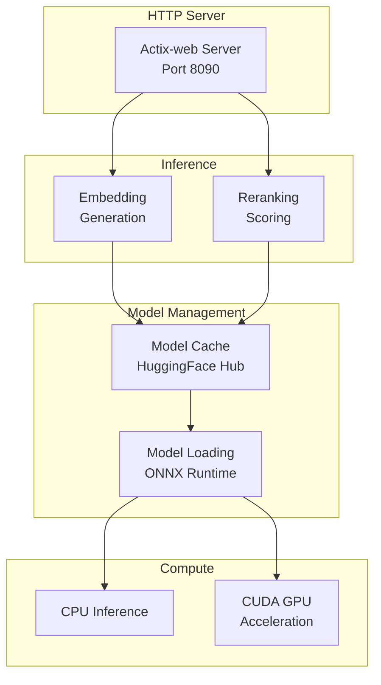

# Embedding Inference API

Local embedding generation server for Semantic Explorer. Provides on-premise embedding and reranking inference using FastEmbed and ONNX Runtime with CUDA acceleration.

## Overview

The embedding inference API is an optional service that provides local embedding generation without relying on cloud providers. Built on FastEmbed (Rust ONNX inference library), it supports multiple embedding models with GPU acceleration via CUDA.

**Use Cases**:
- **Privacy**: Keep data on-premise, no external API calls
- **Cost**: No per-token pricing, unlimited embeddings
- **Latency**: Local inference (no network round-trips)
- **Air-gapped**: Offline deployment without internet access

## Architecture



## Features

### Supported Models

#### Embedding Models

All models from [FastEmbed](https://github.com/Anush008/fastembed-rs) are supported. Popular choices:

**English**:
- `BAAI/bge-small-en-v1.5` (384 dimensions) - Fast, lightweight
- `BAAI/bge-base-en-v1.5` (768 dimensions) - Balanced performance
- `BAAI/bge-large-en-v1.5` (1024 dimensions) - Highest quality
- `sentence-transformers/all-MiniLM-L6-v2` (384 dimensions) - General purpose

**Multilingual**:
- `BAAI/bge-m3` (1024 dimensions) - 100+ languages
- `sentence-transformers/paraphrase-multilingual-MiniLM-L12-v2` (384 dimensions)

**Code**:
- `jinaai/jina-embeddings-v2-base-code` (768 dimensions)

**Long Context**:
- `jinaai/jina-embeddings-v2-base-en` (768 dimensions, 8192 tokens)

#### Reranking Models

- `BAAI/bge-reranker-base` - English reranking
- `BAAI/bge-reranker-large` - Higher quality reranking
- `cross-encoder/ms-marco-MiniLM-L-6-v2` - Fast reranking

### Endpoints

#### POST `/embed`

Generate embeddings for text input.

**Request**:
```json
{
  "input": ["hello world", "semantic search"],
  "model": "BAAI/bge-small-en-v1.5"
}
```

**Response**:
```json
{
  "embeddings": [
    [0.123, -0.456, 0.789, ...],
    [0.234, -0.567, 0.890, ...]
  ],
  "model": "BAAI/bge-small-en-v1.5",
  "usage": {
    "total_tokens": 12
  }
}
```

#### POST `/rerank`

Rerank documents for a query.

**Request**:
```json
{
  "query": "machine learning",
  "documents": [
    "Deep learning is a subset of machine learning",
    "The weather is nice today",
    "Neural networks are used in ML"
  ],
  "model": "BAAI/bge-reranker-base",
  "top_n": 2
}
```

**Response**:
```json
{
  "results": [
    {"index": 0, "score": 0.95, "text": "Deep learning is a subset of machine learning"},
    {"index": 2, "score": 0.87, "text": "Neural networks are used in ML"}
  ],
  "model": "BAAI/bge-reranker-base"
}
```

#### GET `/models`

List available models.

**Response**:
```json
{
  "embedding_models": [
    "BAAI/bge-small-en-v1.5",
    "BAAI/bge-base-en-v1.5",
    "sentence-transformers/all-MiniLM-L6-v2"
  ],
  "reranking_models": [
    "BAAI/bge-reranker-base"
  ]
}
```

#### GET `/health/live`

Liveness probe.

**Response**: `200 OK`

#### GET `/health/ready`

Readiness probe (checks model loaded).

**Response**: `200 OK` if ready, `503 Service Unavailable` if not

### GPU Acceleration

CUDA support via ONNX Runtime:

- **Automatic GPU detection**: Uses CUDA if available, falls back to CPU
- **Mixed precision**: FP16 inference on compatible GPUs
- **Batch processing**: Efficient GPU utilization
- **Multiple compute capabilities**: Built for different NVIDIA architectures

**Supported CUDA Compute Capabilities**:
- 7.5 (Tesla T4, RTX 20 series)
- 8.0 (A100)
- 8.6 (RTX 30 series)
- 8.9 (RTX 40 series)
- 9.0 (H100)

## Configuration

All configuration via environment variables:

### Server Configuration

```bash
# Server binding
API_HOST=0.0.0.0
API_PORT=8090
API_WORKERS=4

# Shutdown timeout
SHUTDOWN_TIMEOUT_SECS=30
```

### Model Configuration

```bash
# Default embedding model
DEFAULT_EMBEDDING_MODEL=BAAI/bge-small-en-v1.5

# Default reranking model
DEFAULT_RERANKING_MODEL=BAAI/bge-reranker-base

# Model cache directory
HF_HOME=/root/.cache/huggingface

# HuggingFace token (for gated models)
HUGGING_FACE_HUB_TOKEN=your-token
```

### Inference Configuration

```bash
# ONNX Runtime execution provider
# Options: cpu, cuda
ORT_EXECUTION_PROVIDER=cuda

# Max batch size for embedding
MAX_EMBEDDING_BATCH_SIZE=256

# Max batch size for reranking
MAX_RERANKING_BATCH_SIZE=64

# Thread count for CPU inference
ORT_NUM_THREADS=4
```

### Observability Configuration

```bash
# OpenTelemetry
OTEL_EXPORTER_OTLP_ENDPOINT=http://localhost:4317
OTEL_SERVICE_NAME=embedding-inference-api
OTEL_SERVICE_VERSION=1.0.0

# Logging
RUST_LOG=info,embedding_inference_api=debug
LOG_FORMAT=json
```

## Building

### Prerequisites

- Rust 1.75+
- CUDA Toolkit 12.x (for GPU support)
- cuDNN 8.x (for GPU support)

### Debug Build

```bash
cargo build -p embedding-inference-api
```

### Release Build

```bash
cargo build -p embedding-inference-api --release
```

Binary location: `target/release/embedding-inference-api`

### Docker Build

**CPU-only**:
```bash
docker build -f crates/embedding-inference-api/Dockerfile \
  --build-arg CUDA_COMPUTE_CAP=none \
  -t embedding-inference-api:cpu .
```

**GPU (CUDA)**:
```bash
docker build -f crates/embedding-inference-api/Dockerfile \
  --build-arg CUDA_COMPUTE_CAP=86 \
  -t embedding-inference-api:cuda12-sm86 .
```

Compute capability options:
- `75` - Tesla T4, RTX 20 series
- `80` - A100
- `86` - RTX 30 series
- `89` - RTX 40 series
- `90` - H100

## Running

### Local Development

```bash
# CPU inference
export ORT_EXECUTION_PROVIDER=cpu
cargo run -p embedding-inference-api

# GPU inference (requires CUDA)
export ORT_EXECUTION_PROVIDER=cuda
cargo run -p embedding-inference-api
```

### Docker (CPU)

```bash
docker run -d \
  --name embedding-inference-api \
  -p 8090:8090 \
  -e DEFAULT_EMBEDDING_MODEL=BAAI/bge-small-en-v1.5 \
  embedding-inference-api:cpu
```

### Docker (GPU)

```bash
docker run -d \
  --name embedding-inference-api \
  --gpus all \
  -p 8090:8090 \
  -e DEFAULT_EMBEDDING_MODEL=BAAI/bge-small-en-v1.5 \
  -e ORT_EXECUTION_PROVIDER=cuda \
  embedding-inference-api:cuda12-sm86
```

### Model Download

Models are automatically downloaded from HuggingFace Hub on first use. To pre-download:

```bash
# Set cache directory
export HF_HOME=/path/to/cache

# Run server (models download on startup)
./embedding-inference-api

# Or use huggingface-cli
pip install huggingface-hub
huggingface-cli download BAAI/bge-small-en-v1.5
```

## Usage Examples

### Generate Embeddings

```bash
curl -X POST http://localhost:8090/embed \
  -H "Content-Type: application/json" \
  -d '{
    "input": ["hello world", "semantic search"],
    "model": "BAAI/bge-small-en-v1.5"
  }'
```

### Rerank Documents

```bash
curl -X POST http://localhost:8090/rerank \
  -H "Content-Type: application/json" \
  -d '{
    "query": "machine learning",
    "documents": [
      "Deep learning is a subset of machine learning",
      "The weather is nice today"
    ],
    "model": "BAAI/bge-reranker-base"
  }'
```

### List Models

```bash
curl http://localhost:8090/models
```

### Health Check

```bash
curl http://localhost:8090/health/ready
```

## Metrics

Prometheus metrics exposed on `/metrics`:

### Request Metrics

```
# Embedding requests
inference_embed_requests_total{model="...",status="success|failure"}

# Embedding latency
inference_embed_duration_seconds{model="..."}

# Items per request
inference_embed_items_total{model="..."}

# Reranking requests
inference_rerank_requests_total{model="...",status="success|failure"}

# Reranking latency
inference_rerank_duration_seconds{model="..."}
```

### Model Metrics

```
# Model load time
model_load_duration_seconds{model="..."}

# Model memory usage
model_memory_bytes{model="..."}

# Active models
models_loaded_total
```

### System Metrics

```
# GPU memory (if CUDA)
gpu_memory_used_bytes
gpu_memory_total_bytes

# CPU usage
cpu_usage_percent
```

## Deployment

### Docker Compose

```yaml
services:
  embedding-inference-api:
    image: embedding-inference-api:cuda12-sm86
    ports:
      - "8090:8090"
    environment:
      DEFAULT_EMBEDDING_MODEL: BAAI/bge-small-en-v1.5
      ORT_EXECUTION_PROVIDER: cuda
      RUST_LOG: info
    volumes:
      - huggingface-cache:/root/.cache/huggingface
    deploy:
      resources:
        reservations:
          devices:
            - driver: nvidia
              count: 1
              capabilities: [gpu]

volumes:
  huggingface-cache:
```

### Kubernetes

```yaml
apiVersion: apps/v1
kind: Deployment
metadata:
  name: embedding-inference-api
spec:
  replicas: 2
  selector:
    matchLabels:
      app: embedding-inference-api
  template:
    metadata:
      labels:
        app: embedding-inference-api
    spec:
      containers:
      - name: embedding-inference-api
        image: embedding-inference-api:cuda12-sm86
        ports:
        - containerPort: 8090
        env:
        - name: DEFAULT_EMBEDDING_MODEL
          value: BAAI/bge-small-en-v1.5
        - name: ORT_EXECUTION_PROVIDER
          value: cuda
        resources:
          requests:
            memory: 2Gi
            cpu: 1000m
            nvidia.com/gpu: 1
          limits:
            memory: 4Gi
            cpu: 2000m
            nvidia.com/gpu: 1
        volumeMounts:
        - name: cache
          mountPath: /root/.cache/huggingface
      volumes:
      - name: cache
        persistentVolumeClaim:
          claimName: huggingface-cache
```

## Troubleshooting

### Model download fails

```
Error: Failed to download model from HuggingFace Hub
```

**Solution**:
- Check internet connection
- Set `HUGGING_FACE_HUB_TOKEN` for gated models
- Pre-download models manually

### CUDA not available

```
Warning: CUDA requested but not available, falling back to CPU
```

**Solution**:
- Install CUDA Toolkit 12.x
- Install cuDNN 8.x
- Verify: `nvidia-smi`
- Rebuild with correct compute capability

### Out of memory (GPU)

```
Error: CUDA out of memory
```

**Solution**:
- Reduce `MAX_EMBEDDING_BATCH_SIZE`
- Use smaller model (e.g., `bge-small` instead of `bge-large`)
- Use FP16 mixed precision
- Upgrade GPU

### Slow inference

```
Inference taking >1 second per batch
```

**Solution**:
- Enable GPU if available
- Increase `API_WORKERS` for more concurrent requests
- Use smaller, faster model
- Batch requests when possible

## Performance Tuning

### Throughput Optimization

```bash
# Increase worker threads
export API_WORKERS=8

# Increase batch size (GPU)
export MAX_EMBEDDING_BATCH_SIZE=512

# Use faster model
export DEFAULT_EMBEDDING_MODEL=sentence-transformers/all-MiniLM-L6-v2
```

### Latency Optimization

```bash
# Reduce batch size for lower latency
export MAX_EMBEDDING_BATCH_SIZE=32

# Use CPU for small batches (avoid GPU transfer overhead)
export ORT_EXECUTION_PROVIDER=cpu
```

### Memory Optimization

```bash
# Reduce model cache size
export HF_HOME=/tmp/hf-cache

# Unload unused models (automatic)
# Use smaller models
export DEFAULT_EMBEDDING_MODEL=BAAI/bge-small-en-v1.5
```

## Benchmarks

Approximate throughput on NVIDIA RTX 3090:

| Model | Batch Size | Tokens/sec | Latency (p95) |
|-------|-----------|------------|---------------|
| bge-small-en-v1.5 | 256 | 50,000 | 120ms |
| bge-base-en-v1.5 | 256 | 35,000 | 180ms |
| bge-large-en-v1.5 | 128 | 20,000 | 280ms |
| all-MiniLM-L6-v2 | 256 | 60,000 | 100ms |

CPU (AMD Ryzen 9 5950X):

| Model | Batch Size | Tokens/sec | Latency (p95) |
|-------|-----------|------------|---------------|
| bge-small-en-v1.5 | 32 | 5,000 | 400ms |
| all-MiniLM-L6-v2 | 32 | 7,000 | 300ms |

## Dependencies

Key dependencies:

- **fastembed** - Rust embedding library (ONNX)
- **ort** - ONNX Runtime bindings with CUDA support
- **actix-web** - HTTP server framework
- **serde/serde_json** - JSON serialization
- **tokio** - Async runtime

See [Cargo.toml](Cargo.toml) for complete list.

## License

Apache License 2.0
