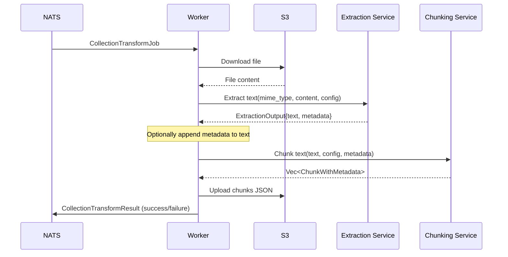

# Worker Collections - Document Text Extraction

Background worker service for document text extraction and chunking in the Semantic Explorer platform. Handles multi-format document processing with configurable text chunking strategies.

## 📋 Overview

The `worker-collections` service processes uploaded documents via NATS JetStream, extracting text and splitting it into optimized chunks for embedding generation.

### Responsibilities
- 📥 Subscribe to collection transform jobs from NATS JetStream
- 📥 Download documents from S3 storage
- 🔤 Extract text content using format-specific extractors
- 📏 Split text into chunks using configurable strategies
- 📤 Upload chunked results back to S3
- 📊 Publish extraction results to API and downstream workers
- ❌ Report failures back to NATS with detailed error messages
- 📝 Log transformation progress and metrics

### Supported Formats

| Category | Formats | Extension | Notes |
|----------|---------|-----------|-------|
| **PDF** | Adobe PDF | `.pdf` | Text layer extraction via pdf-extract |
| **Microsoft Office** | Word | `.docx`, `.docm`, `.dotx`, `.dotm` | Full text with paragraph structure |
| | Legacy Word | `.doc` | OLE/CFB format extraction |
| | Excel | `.xlsx`, `.xlsm`, `.xltx`, `.xltm` | Cell values with sheet organization |
| | PowerPoint | `.pptx`, `.pptm` | Slide text and speaker notes |
| **OpenDocument** | Writer | `.odt` | Full text extraction with metadata |
| | Calc | `.ods` | Cell value extraction |
| | Impress | `.odp` | Slide text extraction |
| **eBooks** | EPUB | `.epub` | Full chapter extraction with metadata |
| **Rich Text** | RTF | `.rtf` | Text with formatting stripped |
| **Web** | HTML | `.html`, `.htm` | Content extraction with structure preservation |
| | XML | `.xml` | Configurable element extraction |
| **Data** | JSON | `.json` | Key-value text extraction |
| | NDJSON | `.ndjson`, `.jsonl` | Line-by-line JSON extraction |
| | CSV | `.csv` | Direct text processing |
| **Email** | Email | `.eml` | Headers, body, and attachments |
| **Logs** | Log files | `.log` | Auto-detected structured log parsing |
| **Markdown** | Markdown | `.md`, `.markdown` | Content with optional structure preservation |
| **Archives** | ZIP | `.zip` | Recursive extraction of contents |
| | TAR.GZ | `.tar.gz`, `.tgz` | Recursive extraction of contents |
| | GZIP | `.gz` | Single file decompression |

## 🏗️ Module Structure

```
src/
├── main.rs              # Worker initialization and NATS subscription
├── job.rs               # Job processing logic and result publishing
├── extract/             # Text extraction from various formats
│   ├── mod.rs           # Module exports
│   ├── config.rs        # Extraction configuration types
│   ├── error.rs         # Extraction error types
│   ├── service.rs       # Extraction orchestration
│   ├── plain_text/      # Main extraction router (MIME-based)
│   ├── pdf/             # PDF text extraction
│   ├── office/          # Microsoft Office (DOCX/XLSX/PPTX)
│   ├── open_office/     # OpenDocument (ODT/ODS/ODP)
│   ├── legacy_doc/      # Legacy .doc (OLE/CFB format)
│   ├── epub/            # EPUB ebook extraction
│   ├── rtf/             # RTF document extraction
│   ├── html/            # HTML web document extraction
│   ├── xml/             # XML structured data extraction
│   ├── json/            # JSON/NDJSON extraction
│   ├── email/           # Email (.eml) extraction
│   ├── log/             # Log file extraction
│   ├── markdown/        # Markdown extraction
│   └── archive/         # ZIP/TAR.GZ archive handling
└── chunk/               # Text chunking logic
    ├── mod.rs           # Module exports
    ├── config.rs        # Chunking configuration types
    ├── service.rs       # Chunking orchestration
    ├── metadata.rs      # Chunk metadata handling
    └── strategies/      # Chunking strategy implementations
        ├── fixed_size.rs          # Fixed-size character chunks
        ├── sentence.rs            # Sentence boundary-based chunks
        ├── recursive_character.rs # Recursive text splitting
        ├── markdown_aware.rs      # Markdown structure-aware chunks
        ├── table_aware.rs         # Table-aware chunks (CSV/TSV/Markdown)
        ├── code_aware.rs          # Programming language-aware chunks
        ├── token_based.rs         # Token-based chunks (for LLM limits)
        ├── semantic.rs            # Semantic similarity-based chunks
        └── overlap.rs             # Overlap application utilities
```

## 🔧 Extraction Configuration

### Extraction Strategies

```json
{
  "strategy": "plain_text",
  "options": {
    "preserve_formatting": false,
    "extract_tables": true,
    "table_format": "plain_text",
    "preserve_headings": true,
    "heading_format": "plain_text",
    "preserve_lists": true,
    "preserve_code_blocks": true,
    "include_metadata": true,
    "append_metadata_to_text": true
  }
}
```

| Strategy | Description |
|----------|-------------|
| `plain_text` | Default extraction, outputs clean text |
| `structure_preserving` | Preserves document structure (headings, lists, tables, code) |
| `markdown` | Converts content to Markdown format with proper syntax |

### Extraction Options

| Option | Type | Default | Description |
|--------|------|---------|-------------|
| `preserve_formatting` | bool | false | Preserve whitespace and formatting |
| `extract_tables` | bool | true | Extract table content |
| `table_format` | string | `plain_text` | Table output format: `plain_text`, `markdown`, `csv` |
| `preserve_headings` | bool | false | Preserve heading structure |
| `heading_format` | string | `plain_text` | Heading format: `plain_text`, `markdown` |
| `preserve_lists` | bool | false | Preserve list formatting |
| `preserve_code_blocks` | bool | false | Preserve code block formatting |
| `include_metadata` | bool | false | Extract document metadata |
| `append_metadata_to_text` | bool | false | Append metadata as text for chunking |

### Metadata Appending

When `append_metadata_to_text` is enabled, extracted metadata (author, title, dates, etc.) is appended as formatted text at the end of the content. This allows metadata to be chunked and embedded alongside the main content for better semantic search.

Example output:
```
Main document content here...

---
Document Metadata:
- Author: John Doe
- Title: Annual Report 2025
- Created At: 2025-01-15
- Page Count: 42
```

## 📏 Chunking Configuration

### Chunking Strategies

```json
{
  "strategy": "fixed",
  "chunk_size": 1000,
  "chunk_overlap": 100,
  "min_chunk_size": 100,
  "max_chunk_size": 2000
}
```

| Strategy | Description | Best For |
|----------|-------------|----------|
| `fixed` | Fixed character count with overlap | General text |
| `sentence` | Sentence boundary-based splitting | Natural language text |
| `recursive` | Hierarchical splitting (paragraphs → sentences → words) | Structured documents |
| `markdown` | Splits on Markdown headings and sections | Markdown documents |
| `table` | Preserves table structure, chunks by rows | Tabular data |
| `code` | Language-aware splitting (functions, classes) | Source code |
| `token` | Token-based for LLM context limits | LLM applications |
| `semantic` | Uses embeddings to find semantic boundaries | High-quality RAG |

### Semantic Chunking

For semantic chunking, an embedder configuration is required:

```json
{
  "strategy": "semantic",
  "chunk_size": 1000,
  "embedder_config": {
    "provider": "openai",
    "base_url": "https://api.openai.com/v1",
    "model": "text-embedding-3-small",
    "api_key": "sk-..."
  }
}
```

## 📊 Job Message Format

### Input: CollectionTransformJob

```json
{
  "job_id": "550e8400-e29b-41d4-a716-446655440000",
  "collection_transform_id": 123,
  "owner": "user@example.com",
  "bucket": "collection-456",
  "source_file_key": "documents/report.pdf",
  "extraction_config": {
    "strategy": "structure_preserving",
    "options": {
      "include_metadata": true,
      "append_metadata_to_text": true,
      "preserve_headings": true
    }
  },
  "chunking_config": {
    "strategy": "sentence",
    "chunk_size": 1000,
    "chunk_overlap": 100
  },
  "embedder_config": null
}
```

### Output: CollectionTransformResult

#### Success
```json
{
  "job_id": "550e8400-e29b-41d4-a716-446655440000",
  "collection_transform_id": 123,
  "owner": "user@example.com",
  "source_file_key": "documents/report.pdf",
  "bucket": "collection-456",
  "chunks_file_key": "chunks/550e8400-e29b-41d4-a716-446655440000.json",
  "chunk_count": 42,
  "status": "success",
  "error": null,
  "processing_duration_ms": 1523
}
```

#### Failure
```json
{
  "job_id": "550e8400-e29b-41d4-a716-446655440000",
  "collection_transform_id": 123,
  "owner": "user@example.com",
  "source_file_key": "documents/report.pdf",
  "bucket": "collection-456",
  "chunks_file_key": "",
  "chunk_count": 0,
  "status": "failed",
  "error": "Extraction failed: Unsupported MIME type video/mp4",
  "processing_duration_ms": 45
}
```

### Chunks File Format

```json
[
  {
    "id": "chunk_0",
    "text": "This is the first chunk of text...",
    "metadata": {
      "source_file": "report.pdf",
      "chunk_index": 0,
      "author": "John Doe",
      "title": "Annual Report"
    }
  },
  {
    "id": "chunk_1",
    "text": "This is the second chunk...",
    "metadata": {
      "source_file": "report.pdf",
      "chunk_index": 1
    }
  }
]
```

## 🚀 Getting Started

### Prerequisites
- Rust 2024 Edition
- NATS 2.10+ (job queue)
- S3-compatible storage (MinIO, AWS S3, etc.)

### Environment Variables

| Variable | Type | Default | Description |
|----------|------|---------|-------------|
| `NATS_URL` | string | `nats://localhost:4222` | NATS server URL |
| `AWS_REGION` | string | **required** | S3 region |
| `AWS_ACCESS_KEY_ID` | string | **required** | S3 access key |
| `AWS_SECRET_ACCESS_KEY` | string | **required** | S3 secret key |
| `AWS_ENDPOINT_URL` | string | **required** | S3 endpoint URL |
| `SERVICE_NAME` | string | `worker-collections` | Service name for tracing |
| `OTEL_EXPORTER_OTLP_ENDPOINT` | string | `http://localhost:4317` | OTLP exporter endpoint |
| `LOG_FORMAT` | string | `json` | Log format (`json` or `pretty`) |
| `RUST_LOG` | string | `info` | Tracing filter directive |
| `MAX_CONCURRENT_JOBS` | integer | `10` | Maximum concurrent job processing |
| `MAX_FILE_SIZE_MB` | integer | `100` | Maximum file size in MB |

### Local Development

```bash
# Set environment variables
export NATS_URL="nats://localhost:4222"
export AWS_REGION="us-east-1"
export AWS_ACCESS_KEY_ID="minioadmin"
export AWS_SECRET_ACCESS_KEY="minioadmin"
export AWS_ENDPOINT_URL="http://localhost:9000"

# Run the worker
cargo run --bin worker-collections
```

### Docker

```bash
docker run \
  -e NATS_URL="nats://nats:4222" \
  -e AWS_REGION="us-east-1" \
  -e AWS_ACCESS_KEY_ID="..." \
  -e AWS_SECRET_ACCESS_KEY="..." \
  -e AWS_ENDPOINT_URL="http://minio:9000" \
  ghcr.io/your-org/worker-collections:latest
```

## 📈 Observability

### Metrics

| Metric | Type | Description |
|--------|------|-------------|
| `worker_jobs_total{worker, status}` | Counter | Job completion count by status |
| `worker_job_duration_seconds{worker}` | Histogram | Job duration |
| `collection_transform_jobs_total{transform_id, status}` | Counter | Transform-specific job count |
| `collection_transform_files_processed{transform_id}` | Counter | Files processed per transform |
| `collection_transform_items_created{transform_id}` | Counter | Chunks created per transform |

### Error Categories

| Status | Description |
|--------|-------------|
| `success` | Job completed successfully |
| `failed_validation` | Invalid bucket name or S3 key |
| `failed_download` | Could not download file from S3 |
| `failed_file_too_large` | File exceeds size limit |
| `failed_config_parse` | Invalid extraction/chunking config |
| `failed_extraction` | Text extraction failed |
| `failed_chunking` | Chunking operation failed |
| `failed_empty_chunks` | No chunks produced (text too short) |
| `failed_upload` | Could not upload results to S3 |

### Tracing

Jobs are traced with the following span attributes:
- `job_id` - Unique job identifier
- `collection_transform_id` - Transform pipeline ID
- `file` - Source file key

## 🧪 Testing

```bash
# Run all tests
cargo test -p worker-collections

# Run with logging
RUST_LOG=debug cargo test -p worker-collections -- --nocapture

# Run specific module tests
cargo test -p worker-collections extract::pdf
cargo test -p worker-collections chunk::strategies
```

Current test coverage: **211 tests**

## 📚 Architecture

### Processing Pipeline



### Failure Handling

All failures are reported back to NATS with:
- `status: "failed"`
- `error`: Detailed error message
- `processing_duration_ms`: Time spent before failure

This enables:
- API to update UI with failure status
- Retry logic with exponential backoff
- Audit logging of all failures
- Metrics for error rate monitoring

## 🤝 Integration

### Upstream (API)
- Receives jobs from API via NATS (`worker.job.file`)
- Reads files from S3 buckets

### Downstream (Worker-Datasets)
- Publishes results to NATS (`worker.result.file`)
- Worker-datasets picks up chunks for embedding

### Storage
- **Reads**: S3 (document files)
- **Writes**: S3 (chunks JSON)

## 📦 Dependencies

| Crate | Purpose |
|-------|---------|
| `tokio` | Async runtime |
| `async-nats` | NATS JetStream client |
| `aws-sdk-s3` | S3 storage client |
| `pdf-extract` | PDF text extraction |
| `quick-xml` | XML parsing |
| `scraper` | HTML parsing |
| `zip` | ZIP archive handling |
| `tar`, `flate2` | TAR.GZ handling |
| `epub` | EPUB ebook extraction |
| `rtf-parser` | RTF document parsing |
| `cfb` | OLE/CFB (legacy .doc) parsing |
| `mail-parser` | Email parsing |
| `docx-rs` | DOCX parsing |
| `calamine` | Excel spreadsheet parsing |
| `unicode-segmentation` | Text segmentation |
| `unicode-normalization` | Text normalization |
| `tiktoken-rs` | Token counting for LLM limits |

## 📄 License

See LICENSE file in repository root.

---

**Version**: 2.0.0  
**Status**: Production Ready ✅  
**Last Updated**: January 2026
