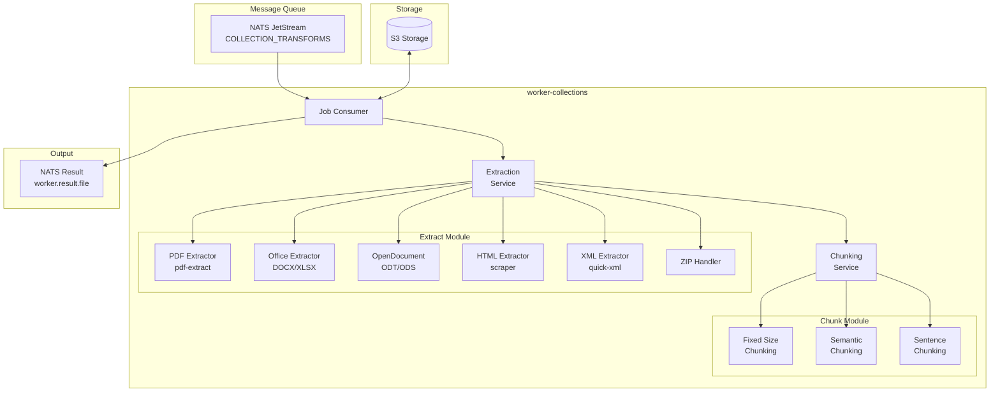
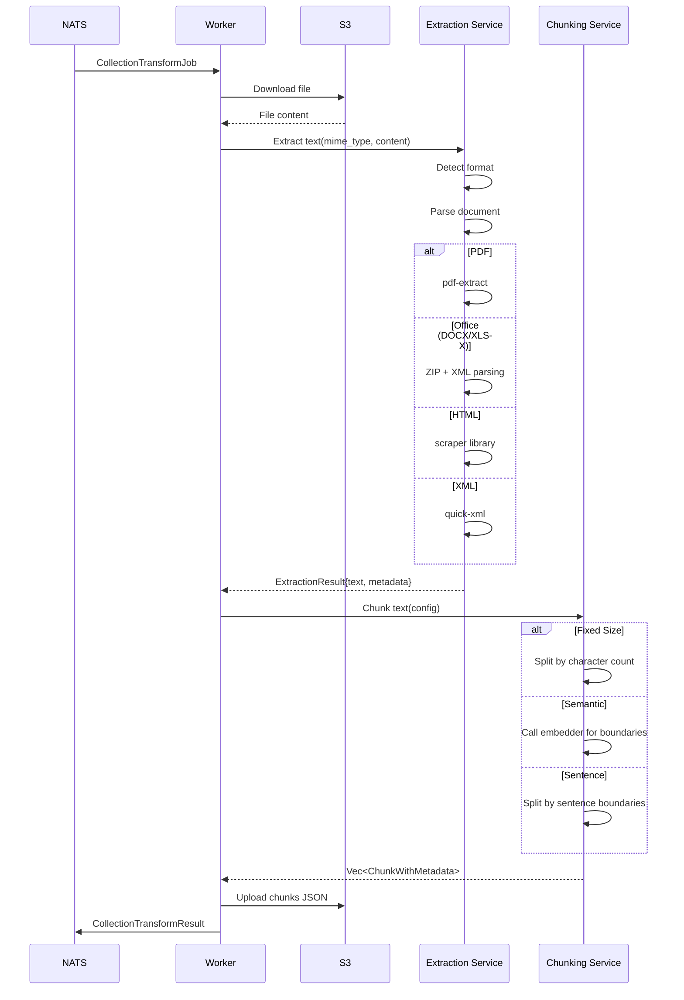

# worker-collections

Background worker service for document text extraction and chunking in the Semantic Explorer platform.

## Overview

The `worker-collections` crate is a NATS JetStream consumer that processes uploaded documents, extracting text content and splitting it into text chunks suitable for embedding generation.

Key responsibilities:
- Subscribe to collection transform jobs from NATS
- Download files from S3 storage
- Extract text from various document formats
- Split text into chunks using configurable strategies
- Upload chunked results back to S3
- Publish processing results for API consumption

## Architecture



## Processing Pipeline



## Supported File Formats

| Format | Extension | Extractor | Notes |
|--------|-----------|-----------|-------|
| PDF | `.pdf` | pdf-extract | Text layer extraction |
| Word | `.docx` | Office (ZIP/XML) | Full text from document.xml |
| Excel | `.xlsx` | Office (ZIP/XML) | Concatenated cell values |
| OpenDocument Text | `.odt` | OpenDocument | Full text extraction |
| OpenDocument Spreadsheet | `.ods` | OpenDocument | Cell value extraction |
| HTML | `.html`, `.htm` | scraper | Text with structure preservation |
| XML | `.xml` | quick-xml | Configurable element extraction |
| ZIP Archive | `.zip` | Built-in | Recursive extraction of contents |
| Plain Text | `.txt` | Direct | No processing needed |

## Chunking Strategies

### Fixed Size Chunking
Splits text into chunks of a specified character count with optional overlap.

```json
{
  "strategy": "fixed",
  "chunk_size": 1000,
  "chunk_overlap": 100
}
```

### Semantic Chunking
Uses an embedder to identify semantic boundaries for more coherent chunks.

```json
{
  "strategy": "semantic",
  "chunk_size": 1000,
  "embedder_config": {
    "provider": "openai",
    "base_url": "https://api.openai.com/v1",
    "model": "text-embedding-3-small"
  }
}
```

### Sentence Chunking
Splits at sentence boundaries while respecting maximum chunk size.

```json
{
  "strategy": "sentence",
  "chunk_size": 1000,
  "chunk_overlap": 50
}
```

## Technologies

| Technology | Version | Purpose |
|------------|---------|---------|
| Rust | 2024 Edition | Language |
| tokio | workspace | Async runtime |
| async-nats | workspace | Message queue consumer |
| aws-sdk-s3 | workspace | S3 storage client |
| pdf-extract | workspace | PDF text extraction |
| quick-xml | workspace | XML parsing |
| scraper | workspace | HTML parsing |
| zip | workspace | ZIP archive handling |
| unicode-segmentation | workspace | Text segmentation |
| unicode-normalization | workspace | Text normalization |

## Module Structure

| Module | Description |
|--------|-------------|
| `main` | Worker initialization and NATS subscription |
| `job` | Job processing logic and result publishing |
| `extract/` | Text extraction from various formats |
| `extract/config` | Extraction configuration types |
| `extract/service` | Extraction orchestration |
| `extract/strategies/` | Format-specific extractors |
| `extract/pdf/` | PDF extraction |
| `extract/office/` | Microsoft Office extraction |
| `extract/open_office/` | OpenDocument extraction |
| `extract/html/` | HTML extraction |
| `extract/xml/` | XML extraction |
| `chunk/` | Text chunking logic |
| `chunk/config` | Chunking configuration types |
| `chunk/service` | Chunking orchestration |
| `chunk/strategies/` | Chunking strategy implementations |
| `chunk/metadata` | Chunk metadata handling |

## Environment Variables

| Variable | Type | Default | Description |
|----------|------|---------|-------------|
| `NATS_URL` | string | `nats://localhost:4222` | NATS server URL |
| `AWS_REGION` | string | **required** | S3 region |
| `AWS_ACCESS_KEY_ID` | string | **required** | S3 access key |
| `AWS_SECRET_ACCESS_KEY` | string | **required** | S3 secret key |
| `AWS_ENDPOINT_URL` | string | **required** | S3 endpoint URL |
| `SERVICE_NAME` | string | `worker-collections` | Service name for tracing |
| `OTEL_EXPORTER_OTLP_ENDPOINT` | string | `http://localhost:4317` | OTLP exporter endpoint |
| `LOG_FORMAT` | string | `json` | Log format (`json` or `pretty`) |
| `RUST_LOG` | string | `info` | Tracing filter directive |
| `MAX_CONCURRENT_JOBS` | integer | `100` | Maximum concurrent job processing |
| `MAX_FILE_SIZE_MB` | integer | `100` | Maximum file size in MB |

## Job Message Format

### Input: CollectionTransformJob

```json
{
  "job_id": "550e8400-e29b-41d4-a716-446655440000",
  "collection_transform_id": 123,
  "owner": "user@example.com",
  "bucket": "collection-456",
  "source_file_key": "documents/report.pdf",
  "extraction_config": {
    "strategy": "default"
  },
  "chunking_config": {
    "strategy": "fixed",
    "chunk_size": 1000,
    "chunk_overlap": 100
  },
  "embedder_config": null
}
```

### Output: CollectionTransformResult

```json
{
  "job_id": "550e8400-e29b-41d4-a716-446655440000",
  "collection_transform_id": 123,
  "owner": "user@example.com",
  "source_file_key": "documents/report.pdf",
  "bucket": "collection-456",
  "chunks_file_key": "chunks/550e8400-e29b-41d4-a716-446655440000.json",
  "chunk_count": 42,
  "status": "success",
  "error": null,
  "processing_duration_ms": 1523
}
```

### Chunks File Format

```json
[
  {
    "id": "chunk_0",
    "text": "This is the first chunk of text...",
    "metadata": {
      "source_file": "report.pdf",
      "chunk_index": 0,
      "page": 1
    }
  },
  {
    "id": "chunk_1",
    "text": "This is the second chunk...",
    "metadata": {
      "source_file": "report.pdf",
      "chunk_index": 1,
      "page": 1
    }
  }
]
```

## Observability

### Metrics

The worker exports the following metrics via the core observability module:

- `worker_jobs_total{worker="transform-file", status="success|failed_*"}` - Job completion counter
- `worker_job_duration_seconds{worker="transform-file"}` - Job duration histogram
- `worker_job_chunks{worker="transform-file"}` - Chunks per job histogram
- `worker_job_file_size_bytes{worker="transform-file"}` - File size histogram
- `collection_transform_jobs_total{transform_id, status}` - Transform-specific counter
- `collection_transform_files_processed{transform_id}` - Files processed counter
- `collection_transform_items_created{transform_id}` - Items created counter

### Tracing

Jobs are traced with the following span attributes:
- `job_id` - Unique job identifier
- `collection_transform_id` - Transform pipeline ID
- `file` - Source file key

### Error Categories

| Status | Description |
|--------|-------------|
| `success` | Job completed successfully |
| `failed_download` | Could not download file from S3 |
| `failed_file_too_large` | File exceeds size limit |
| `failed_config_parse` | Invalid extraction/chunking config |
| `failed_extraction` | Text extraction failed |
| `failed_chunking` | Chunking operation failed |
| `failed_empty_chunks` | No chunks produced (text too short) |
| `failed_upload` | Could not upload results to S3 |

## Running

### Development

```bash
# Set environment variables
export NATS_URL="nats://localhost:4222"
export AWS_REGION="us-east-1"
export AWS_ACCESS_KEY_ID="minioadmin"
export AWS_SECRET_ACCESS_KEY="minioadmin"
export AWS_ENDPOINT_URL="http://localhost:9000"

# Run the worker
cargo run --bin worker-collections
```

### Docker

```bash
docker run \
  -e NATS_URL="nats://nats:4222" \
  -e AWS_REGION="us-east-1" \
  -e AWS_ACCESS_KEY_ID="..." \
  -e AWS_SECRET_ACCESS_KEY="..." \
  -e AWS_ENDPOINT_URL="http://minio:9000" \
  ghcr.io/your-org/worker-collections:latest
```

### Kubernetes

Deploy as part of the Helm chart with horizontal pod autoscaling based on NATS queue depth.

## Scaling Considerations

- **Horizontal Scaling**: Multiple worker replicas can process jobs in parallel
- **Backpressure**: Controlled via `max_ack_pending` in NATS consumer config
- **Memory**: Large files are streamed; peak memory depends on document complexity
- **CPU**: PDF extraction is CPU-intensive; size pods accordingly
- **Retries**: Failed jobs are retried up to 5 times with exponential backoff

## License

See LICENSE file in repository root.
