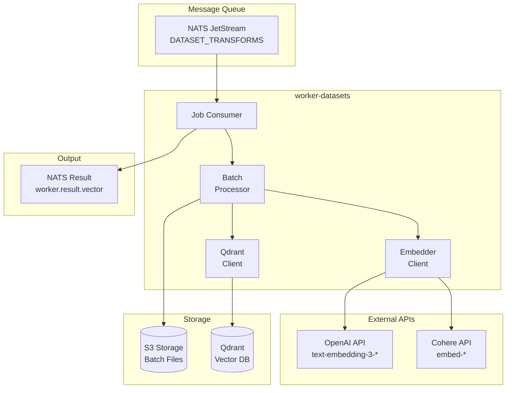
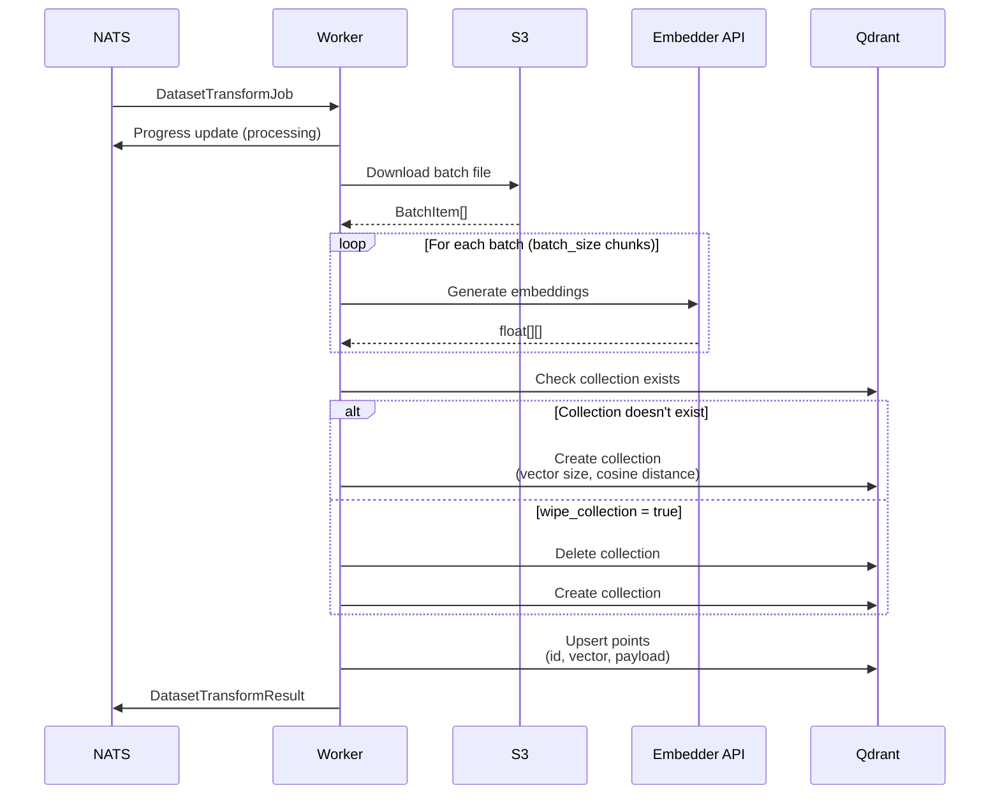
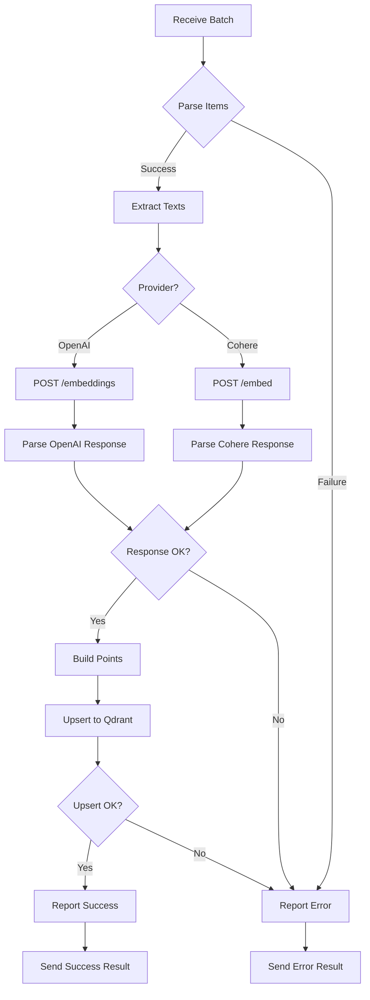

# worker-datasets

Background worker service for generating vector embeddings and storing them in Qdrant for the Semantic Explorer platform.

## Overview

The `worker-datasets` crate is a NATS JetStream consumer that processes batches of text chunks, generates vector embeddings using configured embedder APIs, and stores the resulting vectors in Qdrant for semantic search.

Key responsibilities:
- Subscribe to dataset transform jobs from NATS
- Download chunk batches from S3 storage
- Generate embeddings via embedder APIs (OpenAI, Cohere, etc.)
- Create and manage Qdrant collections
- Upsert vectors with payload metadata to Qdrant
- Publish processing results for API consumption

## Architecture



## Processing Pipeline



## Supported Embedder Providers

| Provider | Models | Batch Size | Notes |
|----------|--------|------------|-------|
| OpenAI | `text-embedding-3-small` (1536d)<br/>`text-embedding-3-large` (3072d)<br/>`text-embedding-ada-002` (1536d) | Up to 2048 | Rate limited by tokens |
| Cohere | `embed-english-v3.0` (1024d)<br/>`embed-multilingual-v3.0` (1024d)<br/>`embed-english-light-v3.0` (384d) | Up to 96 | Input type: search_document |

## Technologies

| Technology | Version | Purpose |
|------------|---------|---------|
| Rust | 2024 Edition | Language |
| tokio | workspace | Async runtime |
| async-nats | workspace | Message queue consumer |
| aws-sdk-s3 | workspace | S3 storage client |
| qdrant-client | 1.16 | Vector database client |
| reqwest | workspace | HTTP client for embedder APIs |
| once_cell | 1.21 | Lazy static initialization |

## Module Structure

| Module | Description |
|--------|-------------|
| `main` | Worker initialization and NATS subscription |
| `job` | Job processing, Qdrant operations, result publishing |
| `embedder` | Embedder API client implementations |

## Environment Variables

| Variable | Type | Default | Description |
|----------|------|---------|-------------|
| `NATS_URL` | string | `nats://localhost:4222` | NATS server URL |
| `AWS_REGION` | string | **required** | S3 region |
| `AWS_ACCESS_KEY_ID` | string | **required** | S3 access key |
| `AWS_SECRET_ACCESS_KEY` | string | **required** | S3 secret key |
| `AWS_ENDPOINT_URL` | string | **required** | S3 endpoint URL |
| `SERVICE_NAME` | string | `worker-datasets` | Service name for tracing |
| `OTEL_EXPORTER_OTLP_ENDPOINT` | string | `http://localhost:4317` | OTLP exporter endpoint |
| `LOG_FORMAT` | string | `json` | Log format (`json` or `pretty`) |
| `RUST_LOG` | string | `info` | Tracing filter directive |
| `MAX_CONCURRENT_JOBS` | integer | `100` | Maximum concurrent job processing |

## Job Message Format

### Input: DatasetTransformJob

```json
{
  "job_id": "550e8400-e29b-41d4-a716-446655440000",
  "dataset_transform_id": 123,
  "embedded_dataset_id": 456,
  "owner": "user@example.com",
  "bucket": "dataset-789",
  "batch_file_key": "batches/batch_001.json",
  "collection_name": "embedded_456_embedder_1",
  "batch_size": 100,
  "wipe_collection": false,
  "embedder_config": {
    "provider": "openai",
    "base_url": "https://api.openai.com/v1",
    "api_key": "sk-...",
    "model": "text-embedding-3-small",
    "dimensions": 1536
  },
  "vector_database_config": {
    "database_type": "qdrant",
    "connection_url": "http://qdrant:6334",
    "api_key": null
  }
}
```

### Batch File Format

```json
[
  {
    "id": "item_1_chunk_0",
    "text": "This is the first chunk of text...",
    "payload": {
      "dataset_item_id": 1,
      "dataset_id": 789,
      "item_title": "Document Title",
      "chunk_index": 0
    }
  },
  {
    "id": "item_1_chunk_1",
    "text": "This is the second chunk...",
    "payload": {
      "dataset_item_id": 1,
      "dataset_id": 789,
      "item_title": "Document Title",
      "chunk_index": 1
    }
  }
]
```

### Output: DatasetTransformResult

```json
{
  "job_id": "550e8400-e29b-41d4-a716-446655440000",
  "dataset_transform_id": 123,
  "embedded_dataset_id": 456,
  "owner": "user@example.com",
  "batch_file_key": "batches/batch_001.json",
  "chunk_count": 42,
  "status": "success",
  "error": null,
  "processing_duration_ms": 3250
}
```

## Qdrant Collection Schema

Collections are created with the following configuration:

```rust
Collection {
    name: "{embedded_dataset_id}_embedder_{embedder_id}",
    vectors: VectorParams {
        size: <embedding_dimensions>,
        distance: Cosine,
    }
}
```

### Point Structure

```json
{
  "id": "item_1_chunk_0",
  "vector": [0.123, -0.456, ...],
  "payload": {
    "text": "Original chunk text (for preview)",
    "dataset_item_id": 1,
    "dataset_id": 789,
    "item_title": "Document Title",
    "chunk_index": 0
  }
}
```

## Observability

### Metrics

The worker exports the following metrics via the core observability module:

- `worker_jobs_total{worker="vector-embed", status="success|failed_*"}` - Job completion counter
- `worker_job_duration_seconds{worker="vector-embed"}` - Job duration histogram
- `dataset_transform_jobs_total{transform_id, embedded_dataset_id, status}` - Transform-specific counter
- `dataset_transform_batches_processed{transform_id, embedded_dataset_id}` - Batches processed counter
- `dataset_transform_chunks_embedded{transform_id, embedded_dataset_id}` - Chunks embedded counter

### Tracing

Jobs are traced with the following span attributes:
- `job_id` - Unique job identifier
- `dataset_transform_id` - Transform pipeline ID
- `embedded_dataset_id` - Target embedded dataset ID
- `collection` - Qdrant collection name

### Error Categories

| Status | Description |
|--------|-------------|
| `success` | Job completed successfully |
| `success_empty` | Empty batch (no items to process) |
| `failed_download` | Could not download batch from S3 |
| `failed_parse` | Invalid batch JSON format |
| `failed_embedding` | Embedder API call failed |
| `failed_mismatch` | Embedding count doesn't match input |
| `failed_upsert` | Qdrant upsert operation failed |

## Embedding Generation Flow



## Running

### Development

```bash
# Set environment variables
export NATS_URL="nats://localhost:4222"
export AWS_REGION="us-east-1"
export AWS_ACCESS_KEY_ID="minioadmin"
export AWS_SECRET_ACCESS_KEY="minioadmin"
export AWS_ENDPOINT_URL="http://localhost:9000"

# Run the worker
cargo run --bin worker-datasets
```

### Docker

```bash
docker run \
  -e NATS_URL="nats://nats:4222" \
  -e AWS_REGION="us-east-1" \
  -e AWS_ACCESS_KEY_ID="..." \
  -e AWS_SECRET_ACCESS_KEY="..." \
  -e AWS_ENDPOINT_URL="http://minio:9000" \
  ghcr.io/your-org/worker-datasets:latest
```

### Kubernetes

Deploy as part of the Helm chart with horizontal pod autoscaling based on NATS queue depth.

## Scaling Considerations

- **Horizontal Scaling**: Multiple worker replicas can process jobs in parallel
- **Backpressure**: Controlled via `max_ack_pending` in NATS consumer config
- **Memory**: Memory usage scales with batch size and embedding dimensions
- **Rate Limits**: Embedder APIs have rate limits; configure `batch_size` accordingly
- **Retries**: Failed jobs are retried up to 5 times with exponential backoff
- **Qdrant Sharding**: For large-scale deployments, configure Qdrant sharding

## Cost Considerations

Embedding API calls are billed per token/request:

| Provider | Pricing Model | Optimization |
|----------|--------------|--------------|
| OpenAI | Per 1K tokens | Batch requests, use smaller model when possible |
| Cohere | Per API call | Maximize batch size (up to 96) |

Monitor the `dataset_transform_chunks_embedded` metric to track usage.

## License

See LICENSE file in repository root.
