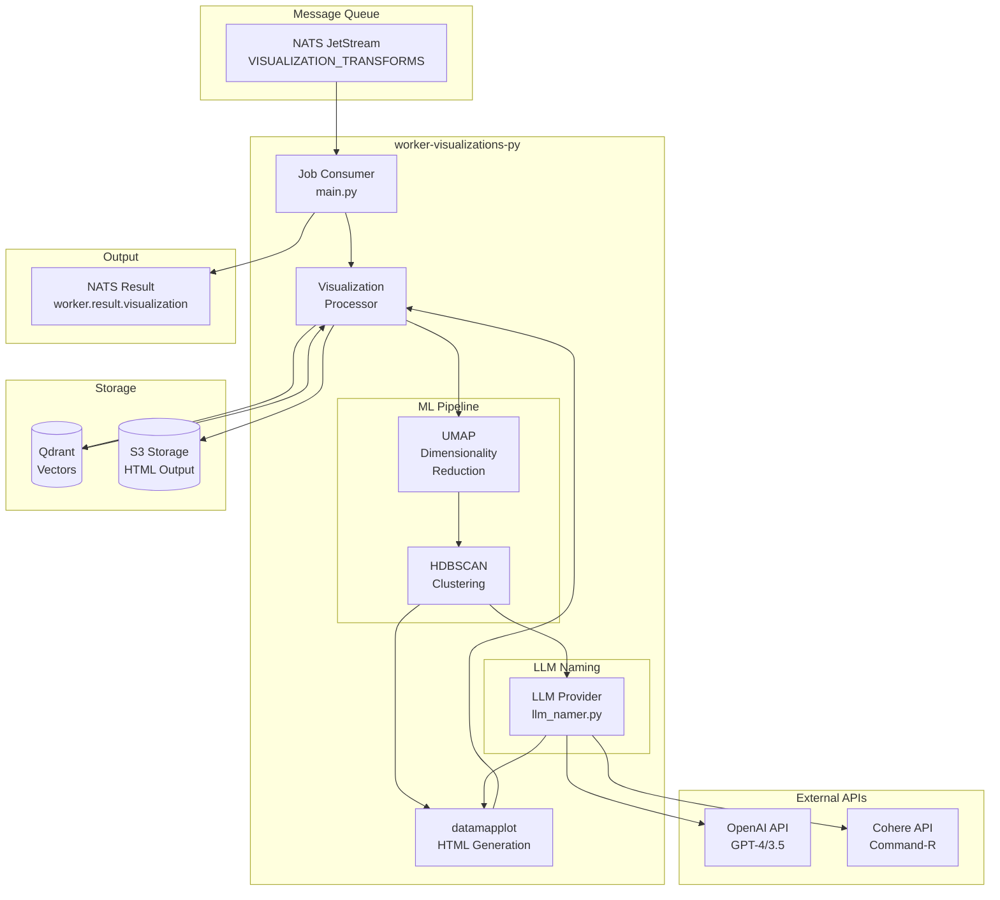
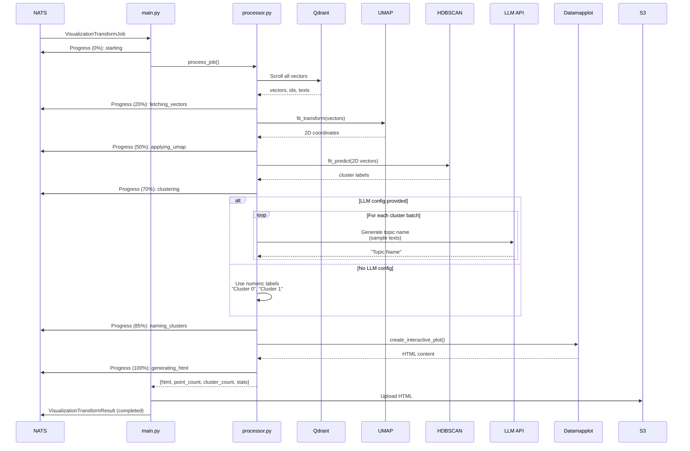

# worker-visualizations-py

Python worker service for generating interactive visualizations of embedded vector datasets using UMAP dimensionality reduction, HDBSCAN clustering, and datamapplot rendering.

## Overview

The `worker-visualizations-py` module is a NATS JetStream consumer that processes visualization transform jobs, generating interactive HTML visualizations from high-dimensional vector embeddings stored in Qdrant.

Key responsibilities:
- Subscribe to visualization transform jobs from NATS
- Fetch vectors and metadata from Qdrant
- Apply UMAP for dimensionality reduction (N-d to 2-d)
- Apply HDBSCAN for automatic cluster detection
- Generate human-readable cluster labels using LLM APIs (optional)
- Create interactive HTML visualizations using datamapplot
- Upload results to S3 storage
- Publish processing results for API consumption

## Architecture



## Processing Pipeline



## Technologies

| Technology | Version | Purpose |
|------------|---------|---------|
| Python | 3.12+ | Language |
| asyncio | stdlib | Async runtime |
| nats-py | latest | Message queue consumer |
| qdrant-client | latest | Vector database client |
| umap-learn | latest | Dimensionality reduction |
| hdbscan | latest | Density-based clustering |
| datamapplot | latest | Interactive visualization |
| numpy | latest | Numerical operations |
| pydantic | latest | Data validation |
| boto3 | latest | S3 storage client |
| openai | latest | OpenAI API client |
| cohere | latest | Cohere API client |

## Module Structure

| Module | Description |
|--------|-------------|
| `main.py` | Worker entry point, NATS subscription, job orchestration |
| `processor.py` | Visualization processing pipeline |
| `models.py` | Pydantic data models for jobs and results |
| `storage.py` | S3 storage operations |
| `llm_namer.py` | LLM-based cluster topic naming |

## Environment Variables

| Variable | Type | Default | Description |
|----------|------|---------|-------------|
| `NATS_URL` | string | `nats://localhost:4222` | NATS server URL |
| `AWS_REGION` | string | **required** | S3 region |
| `AWS_ACCESS_KEY_ID` | string | **required** | S3 access key |
| `AWS_SECRET_ACCESS_KEY` | string | **required** | S3 secret key |
| `AWS_ENDPOINT_URL` | string | **required** | S3 endpoint URL |
| `PROCESSING_TIMEOUT_SECS` | integer | `3600` | Job timeout (1 hour default) |
| `WORKER_ID` | string | UUID | Unique worker identifier |
| `LOG_LEVEL` | string | `INFO` | Python logging level (DEBUG, INFO, WARNING, ERROR) |
| `LOG_FORMAT` | string | `json` | Log format (json for structured logging) |
| `MAX_CONCURRENT_JOBS` | integer | `3` | Maximum concurrent jobs |
| `HEALTH_CHECK_PORT` | integer | `8081` | Port for health check HTTP server |

## Job Message Format

### Input: VisualizationTransformJob

```json
{
  "job_id": "550e8400-e29b-41d4-a716-446655440000",
  "visualization_transform_id": 123,
  "visualization_id": 456,
  "owner": "user@example.com",
  "embedded_dataset_id": 789,
  "qdrant_collection_name": "embedded_789_embedder_1",
  "visualization_config": {
    "n_neighbors": 15,
    "min_dist": 0.1,
    "metric": "cosine",
    "min_cluster_size": 15,
    "min_samples": 5,
    "llm_batch_size": 10,
    "samples_per_cluster": 5,
    "darkmode": false,
    "width": "100%",
    "height": 800,
    "title": "Document Clusters",
    "noise_label": "",
    "noise_color": "#999999"
  },
  "vector_database_config": {
    "database_type": "qdrant",
    "connection_url": "http://qdrant:6334",
    "api_key": null
  },
  "llm_config": {
    "llm_id": 1,
    "provider": "openai",
    "model": "gpt-4",
    "api_key": "sk-..."
  }
}
```

### Output: VisualizationTransformResult

```json
{
  "jobId": "550e8400-e29b-41d4-a716-446655440000",
  "visualizationTransformId": 123,
  "visualizationId": 456,
  "owner": "user@example.com",
  "status": "completed",
  "htmlS3Key": "visualizations/user@example.com/123/456.html",
  "pointCount": 5000,
  "clusterCount": 42,
  "processingDurationMs": 125000,
  "errorMessage": null,
  "statsJson": {
    "unique_clusters": 42,
    "noise_points": 127,
    "umap_n_neighbors": 15,
    "hdbscan_min_cluster_size": 15
  }
}
```

### Progress Updates

During processing, progress updates are published to the result topic:

```json
{
  "jobId": "550e8400-e29b-41d4-a716-446655440000",
  "visualizationTransformId": 123,
  "visualizationId": 456,
  "owner": "user@example.com",
  "status": "processing",
  "statsJson": {
    "stage": "applying_umap",
    "progress_percent": 50
  }
}
```

## Visualization Configuration

### UMAP Parameters

| Parameter | Type | Default | Description |
|-----------|------|---------|-------------|
| `n_neighbors` | integer | 15 | Number of neighbors for UMAP graph |
| `min_dist` | float | 0.1 | Minimum distance between points |
| `metric` | string | "cosine" | Distance metric |

### HDBSCAN Parameters

| Parameter | Type | Default | Description |
|-----------|------|---------|-------------|
| `min_cluster_size` | integer | 15 | Minimum cluster size |
| `min_samples` | integer | 5 | Core point threshold |

### Datamapplot Parameters

| Parameter | Type | Default | Description |
|-----------|------|---------|-------------|
| `title` | string | null | Plot title |
| `sub_title` | string | null | Plot subtitle |
| `width` | string | "100%" | Plot width |
| `height` | integer | 800 | Plot height in pixels |
| `darkmode` | boolean | false | Dark theme |
| `noise_label` | string | "" | Label for noise points |
| `noise_color` | string | "#999999" | Color for noise points |
| `inline_data` | boolean | true | Embed data in HTML |
| `color_label_text` | boolean | true | Color cluster labels |
| `label_wrap_width` | integer | 16 | Label wrapping width |
| `cluster_boundary_polygons` | boolean | false | Draw cluster boundaries |
| `enable_topic_tree` | boolean | false | Show topic hierarchy |

### LLM Naming Parameters

| Parameter | Type | Default | Description |
|-----------|------|---------|-------------|
| `llm_batch_size` | integer | 10 | Clusters per LLM batch |
| `samples_per_cluster` | integer | 5 | Sample texts per cluster |

## LLM Providers

### OpenAI

```json
{
  "provider": "openai",
  "model": "gpt-4",
  "api_key": "sk-...",
  "config": {}
}
```

### Cohere

```json
{
  "provider": "cohere",
  "model": "command-r-plus",
  "api_key": "...",
  "config": {}
}
```

## Output HTML Structure

The generated HTML visualization includes:

- Interactive 2D scatter plot with pan/zoom
- Color-coded cluster regions
- Hover tooltips showing document text
- Cluster labels positioned at centroids
- Optional topic tree hierarchy
- Search functionality
- Export capabilities

## Observability

### Logging

The worker outputs structured logs at configurable levels:

```
2024-01-11 12:00:00 - main - INFO - Starting visualization worker
2024-01-11 12:00:01 - processor - INFO - Fetched 5000 vectors in 2.5s
2024-01-11 12:00:30 - processor - INFO - UMAP complete: (5000, 1536) -> (5000, 2)
2024-01-11 12:00:35 - processor - INFO - HDBSCAN complete: 42 clusters, 127 noise
2024-01-11 12:01:00 - main - INFO - Job completed: 5000 points, 42 clusters
```

### Progress Tracking

Progress updates are published to NATS for frontend consumption:

| Stage | Progress | Description |
|-------|----------|-------------|
| `starting` | 0% | Job acknowledged |
| `fetching_vectors` | 5-20% | Scrolling Qdrant |
| `applying_umap` | 25-50% | UMAP processing |
| `clustering` | 55-70% | HDBSCAN processing |
| `naming_clusters` | 72-85% | LLM API calls |
| `generating_html` | 88-100% | Datamapplot rendering |

## Health Checks and Graceful Shutdown

The worker implements Kubernetes-compatible health checks and graceful shutdown handling:

### Health Check Endpoints

A health check HTTP server runs on port 8081 (configurable via `HEALTH_CHECK_PORT`):

#### Liveness Probe
```bash
curl http://localhost:8081/health
# Returns 200 OK if worker process is running
```

**Use case**: Kubernetes liveness probe - restart pod if this fails

#### Readiness Probe
```bash
curl http://localhost:8081/ready
# Returns 200 OK if worker is ready to accept jobs
# Returns 503 Service Unavailable if:
#   - Worker is processing a job that exceeded max wait time
#   - Recent errors indicate worker is degraded
```

**Use case**: Kubernetes readiness probe - remove from service if this fails

### Kubernetes Configuration

Example Kubernetes pod specification:

```yaml
apiVersion: v1
kind: Pod
metadata:
  name: visualization-worker
spec:
  containers:
  - name: worker
    image: visualization-worker:latest
    ports:
    - containerPort: 8081
      name: health

    # Liveness: restart if worker process dies
    livenessProbe:
      httpGet:
        path: /health
        port: health
      initialDelaySeconds: 30
      periodSeconds: 10
      timeoutSeconds: 5
      failureThreshold: 3

    # Readiness: remove from service if degraded
    readinessProbe:
      httpGet:
        path: /ready
        port: health
      initialDelaySeconds: 15
      periodSeconds: 5
      timeoutSeconds: 3
      failureThreshold: 2

    # Graceful shutdown
    terminationGracePeriodSeconds: 300  # Wait up to 5 minutes
    lifecycle:
      preStop:
        exec:
          command: ["/bin/sh", "-c", "sleep 5"]  # Give load balancer time to stop routing
```

### Graceful Shutdown

When the worker receives SIGTERM or SIGINT:

1. **Signal handling**: Acknowledges the termination signal
2. **Stop accepting jobs**: No new jobs are dequeued from NATS
3. **Complete in-flight jobs**: Waits for all active jobs to finish (max 5 minutes)
4. **Clean shutdown**: Closes NATS connection and exits
5. **Timeout protection**: Force exits after 5 minutes even if jobs are still running

**Implementation details**:
- Catches SIGTERM/SIGINT signals via `signal.signal()`
- Uses asyncio.Event to coordinate graceful shutdown
- Active job counter tracks in-flight work
- Waits with timeout to prevent hanging

### Structured Logging

The worker outputs structured JSON logs for centralized log aggregation (ELK, Datadog, etc.):

```json
{
  "timestamp": "2024-01-11T12:00:00Z",
  "level": "INFO",
  "logger": "main",
  "message": "Starting visualization worker",
  "worker_id": "a1b2c3d4-e5f6-4a7b-8c9d-0e1f2a3b4c5d"
}
```

**Configuration**:
```bash
# Enable structured JSON logging (default)
export LOG_FORMAT="json"

# Optional: set log level
export LOG_LEVEL="INFO"  # DEBUG, INFO, WARNING, ERROR
```

**Log format**: Each log entry includes:
- `timestamp`: ISO 8601 timestamp
- `level`: Log level (DEBUG, INFO, WARNING, ERROR)
- `logger`: Logger name (main, processor, storage, etc.)
- `message`: Human-readable message
- `context`: Additional structured fields (job_id, error_type, etc.)

## Running

### Development

```bash
# Create virtual environment
python -m venv venv
source venv/bin/activate

# Install dependencies
pip install -r requirements.txt

# Set environment variables
export NATS_URL="nats://localhost:4222"
export AWS_REGION="us-east-1"
export AWS_ACCESS_KEY_ID="minioadmin"
export AWS_SECRET_ACCESS_KEY="minioadmin"
export AWS_ENDPOINT_URL="http://localhost:9000"

# Run the worker
python -m src.main
```

### Docker

```dockerfile
FROM python:3.12-slim

WORKDIR /app
COPY requirements.txt .
RUN pip install --no-cache-dir -r requirements.txt

COPY src/ ./src/

CMD ["python", "-m", "src.main"]
```

```bash
docker run \
  -e NATS_URL="nats://nats:4222" \
  -e AWS_REGION="us-east-1" \
  -e AWS_ACCESS_KEY_ID="..." \
  -e AWS_SECRET_ACCESS_KEY="..." \
  -e AWS_ENDPOINT_URL="http://minio:9000" \
  ghcr.io/your-org/worker-visualizations-py:latest
```

### Kubernetes

Deploy as part of the Helm chart. Resource recommendations:

```yaml
resources:
  requests:
    memory: "4Gi"
    cpu: "2000m"
  limits:
    memory: "16Gi"
    cpu: "4000m"
```

## Performance Considerations

### Memory Usage

Memory consumption scales with:
- Number of vectors (N)
- Vector dimensions (D)
- Peak usage: ~`N * D * 4 bytes * 3` (vectors + UMAP + intermediate)

For 100,000 vectors at 1536 dimensions:
- Vectors: ~600 MB
- UMAP working: ~600 MB
- Peak: ~2 GB

### Processing Time

Typical processing times (CPU):

| Vectors | UMAP | HDBSCAN | Total |
|---------|------|---------|-------|
| 1,000 | 5s | <1s | ~10s |
| 10,000 | 30s | 2s | ~1m |
| 50,000 | 3m | 15s | ~5m |
| 100,000 | 10m | 1m | ~15m |

### Scaling Recommendations

- **Horizontal Scaling**: Run multiple workers with `MAX_CONCURRENT_JOBS=1-3`
- **Memory**: Size pods based on expected dataset size
- **Timeout**: Adjust `PROCESSING_TIMEOUT_SECS` for large datasets
- **Sampling**: For very large datasets (>100K), implement random sampling

## Error Handling

| Error Type | Handling |
|------------|----------|
| Invalid JSON | Ack message (prevent reprocessing) |
| Validation Error | Ack message with error result |
| Qdrant Connection | Nak message (retry) |
| UMAP/HDBSCAN | Report error, nak message |
| LLM API Failure | Fall back to numeric labels |
| S3 Upload Failure | Report error, nak message |
| Timeout | Report timeout, nak message |

## License

See LICENSE file in repository root.
