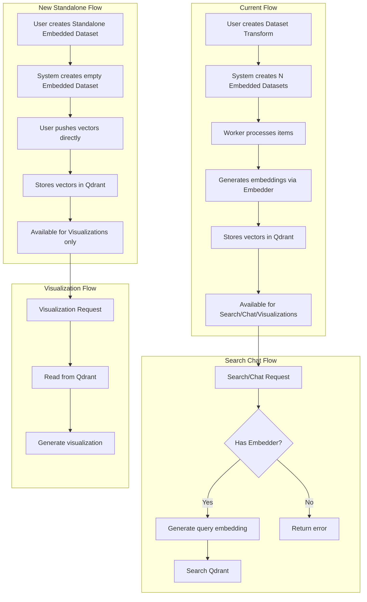

# Standalone Embedded Datasets Feature Plan

## Overview
Enable users to create empty embedded dataset objects and push vectors and metadata directly to them, bypassing the need for collection transforms, dataset transforms, or embedders. These standalone embedded datasets will be usable in visualizations but not in search/chat (since they lack an associated embedder).

## Current System Analysis

### Existing Embedded Dataset Structure
The `embedded_datasets` table currently has:
- `embedded_dataset_id` (PK)
- `title`
- `dataset_transform_id` (FK to dataset_transforms) - **REQUIRED**
- `source_dataset_id` (FK to datasets) - **REQUIRED**
- `embedder_id` (FK to embedders) - **REQUIRED**
- `owner_id`, `owner_display_name`
- `collection_name` (Qdrant collection)
- `last_processed_at`, `created_at`, `updated_at`
- UNIQUE constraint on `(dataset_transform_id, embedder_id)`

### Current Workflow
1. Users create a dataset transform with source dataset and embedders
2. System creates N embedded datasets (one per embedder)
3. Worker processes dataset items, generates embeddings, stores in Qdrant
4. Search/Chat requires `embedder_id` to generate query embeddings
5. Visualizations only need the Qdrant collection name

## Design Decisions

### 1. Database Schema Changes

#### Option Selected: Sentinel Values
- Keep existing UNIQUE constraint on `(dataset_transform_id, embedder_id)`
- Use sentinel value `0` for both fields in standalone datasets
- Add new field `dimensions` (INTEGER) to store vector dimensionality

#### Migration Required
```sql
-- Add dimensions field for standalone datasets
ALTER TABLE embedded_datasets ADD COLUMN dimensions INTEGER NULL;

-- Update UNIQUE constraint to allow sentinel value 0
-- Existing constraint: UNIQUE(dataset_transform_id, embedder_id)
-- This will work with sentinel value 0 for standalone datasets
```

### 2. Model Changes

#### EmbeddedDataset Model
Add `dimensions` field (optional, only for standalone datasets):
```rust
pub struct EmbeddedDataset {
    pub embedded_dataset_id: i32,
    pub title: String,
    pub dataset_transform_id: i32,  // 0 for standalone
    pub source_dataset_id: i32,      // 0 for standalone
    pub embedder_id: i32,           // 0 for standalone
    pub owner_id: String,
    pub owner_display_name: String,
    pub collection_name: String,
    pub dimensions: Option<i32>,      // NEW: Vector dimensions for standalone
    pub created_at: DateTime<Utc>,
    pub updated_at: DateTime<Utc>,
    pub last_processed_at: Option<DateTime<Utc>>,
}
```

#### New Request Models
```rust
#[derive(Deserialize, ToSchema)]
pub struct CreateStandaloneEmbeddedDatasetRequest {
    pub title: String,
    pub dimensions: i32,  // Required: Vector dimensionality
}

#[derive(Deserialize, ToSchema)]
pub struct PushVectorsRequest {
    pub points: Vec<VectorPoint>,
}

#[derive(Deserialize, ToSchema)]
pub struct VectorPoint {
    pub id: String,              // Point ID (UUID or string)
    pub vector: Vec<f32>,        // Vector data
    pub payload: serde_json::Value,  // Metadata
}
```

### 3. API Endpoints

#### Create Standalone Embedded Dataset
```
POST /api/embedded-datasets/standalone
```
- Creates empty embedded dataset without transform/dataset/embedder
- Requires: `title`, `dimensions`
- Creates Qdrant collection with specified dimensions
- Sets `dataset_transform_id = 0`, `source_dataset_id = 0`, `embedder_id = 0`
- Returns created embedded dataset

#### Push Vectors to Embedded Dataset
```
POST /api/embedded-datasets/{id}/push-vectors
```
- Pushes batch of vectors to embedded dataset
- Requires: array of points (id, vector, payload)
- Validates vector dimensions match dataset's dimensions
- Inserts points into Qdrant collection
- Returns count of points inserted

#### Get Embedded Dataset (Updated)
```
GET /api/embedded-datasets/{id}
```
- Add `is_standalone` boolean to response
- `is_standalone = true` when `dataset_transform_id == 0`

#### List Embedded Datasets (Updated)
```
GET /api/embedded-datasets
```
- Add `is_standalone` boolean to each dataset
- Optionally add query param `?type=standalone|transform` to filter

### 4. Search/Chat Behavior

#### Search API (`/api/search`)
- Filter out standalone datasets from search results
- Return error if user explicitly selects standalone dataset
- Error message: "This embedded dataset does not support search (no embedder configured)"

#### Chat/RAG (`retrieve_documents`)
- Return error if standalone dataset is used
- Error message: "This embedded dataset does not support chat (no embedder configured)"

### 5. Visualization Behavior
- No changes needed
- Visualizations work with any Qdrant collection
- Standalone datasets are fully usable in visualizations

## Implementation Steps

### Phase 1: Database & Models
1. Create migration to add `dimensions` column to `embedded_datasets`
2. Update `EmbeddedDataset` model to include `dimensions` field
3. Update `EmbeddedDatasetWithDetails` model to include `dimensions` and `is_standalone`
4. Create new request/response models:
   - `CreateStandaloneEmbeddedDatasetRequest`
   - `PushVectorsRequest`
   - `VectorPoint`

### Phase 2: Storage Layer
1. Add `create_standalone_embedded_dataset()` function
2. Add `push_vectors_to_embedded_dataset()` function
3. Update queries to handle sentinel value `0` for standalone datasets
4. Update `get_embedded_dataset_with_details()` to include `is_standalone` flag

### Phase 3: API Layer
1. Add `create_standalone_embedded_dataset()` endpoint
2. Add `push_vectors_to_embedded_dataset()` endpoint
3. Update `get_embedded_dataset()` to return `is_standalone` flag
4. Update `get_embedded_datasets()` to return `is_standalone` flag
5. Add optional `type` query parameter to filter by standalone/transform

### Phase 4: Search & Chat Integration
1. Update search API to filter out standalone datasets
2. Update chat/RAG to return error for standalone datasets
3. Add appropriate error messages

### Phase 5: Qdrant Integration
1. Update Qdrant collection creation to support custom dimensions
2. Ensure vector validation on push (dimensions must match)

### Phase 6: UI Updates
1. Add "Create Standalone Embedded Dataset" button/modal
2. Update embedded datasets list to show type (standalone vs transform)
3. Add "Push Vectors" button for standalone datasets
4. Update search UI to filter out standalone datasets
5. Update chat UI to prevent selecting standalone datasets

### Phase 7: Testing
1. Unit tests for new storage functions
2. Integration tests for new API endpoints
3. Test search/chat error handling for standalone datasets
4. Test visualization with standalone datasets
5. Test vector dimension validation

## Mermaid Diagram



## Edge Cases & Considerations

1. **Vector Dimension Mismatch**: Validate pushed vectors match dataset dimensions
2. **Empty Datasets**: Allow creation of empty standalone datasets
3. **Deletion**: Ensure Qdrant collection is deleted when standalone dataset is deleted
4. **Permissions**: Apply same RLS policies as regular embedded datasets
5. **Stats**: Standalone datasets won't have `last_processed_at` (no transform processing)
6. **Batch Size**: Consider limits on number of vectors per push request
7. **Point IDs**: Support both UUID and numeric point IDs

## Success Criteria

- [ ] Users can create standalone embedded datasets via API
- [ ] Users can push vectors to standalone datasets via API
- [ ] Standalone datasets appear in embedded datasets list with `is_standalone: true`
- [ ] Standalone datasets work in visualizations
- [ ] Standalone datasets return appropriate errors in search/chat
- [ ] Vector dimension validation works correctly
- [ ] Qdrant collections are properly created and cleaned up
- [ ] UI supports creating and managing standalone datasets
