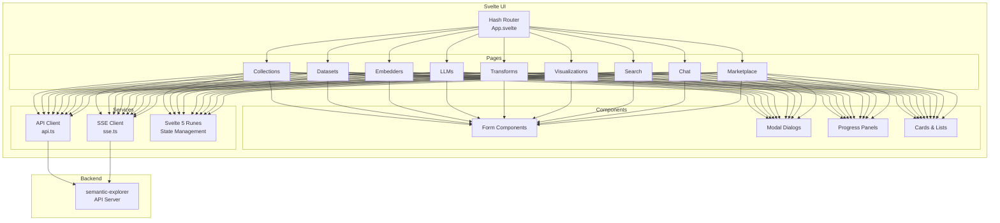

# Semantic Explorer UI

<div align="center">


**Modern single-page application for the Semantic Explorer platform**

</div>

Provides an intuitive interface for document management, semantic search, and interactive data visualizations.

## Overview

The `semantic-explorer-ui` is built with Svelte 5 and provides:

- **Document Management** - Collection management with file uploads and organization
- **Dataset Operations** - Dataset creation and item management with chunking
- **Embedder Configuration** - Manage multiple embedding models and providers
- **LLM Management** - Configure and test LLM providers (OpenAI, Cohere and Internal LLM inference API)
- **Transform Pipelines** - Orchestrate document extraction, embedding, and visualization workflows
- **Real-time Progress** - Polling-based progress tracking for transforms, SSE streaming for chat
- **Interactive Visualizations** - Interactive visualizations rendered via datamapplot (embeds Deck.gl in generated HTML)
- **Semantic Search** - Vector similarity search across embedded datasets
- **RAG Chat** - Chat with documents using retrieval-augmented generation with SSE streaming
- **Marketplace** - Discover and grab public resources
- **Theme Support** - Light/dark/system theme with persistence

## Project Structure

```
semantic-explorer-ui/
├── src/
│   ├── main.ts                  # Application entry point
│   ├── App.svelte               # Root component with hash-based routing
│   ├── app.css                  # Global styles (Tailwind)
│   └── lib/
│       ├── ApiExamples.svelte   # API examples component
│       ├── Sidebar.svelte       # Navigation sidebar
│       ├── TopBanner.svelte     # Top navigation banner
│       ├── composables/         # Svelte 5 composables
│       │   └── useChatStream.svelte.ts  # SSE chat streaming
│       ├── pages/               # Page components (26 pages)
│       │   ├── Dashboard.svelte
│       │   ├── Collections.svelte
│       │   ├── Datasets.svelte
│       │   ├── Embedders.svelte
│       │   ├── Chat.svelte
│       │   ├── Search.svelte
│       │   ├── NatsStatus.svelte
│       │   ├── VisualizationCompare.svelte
│       │   └── ...
│       ├── components/          # Reusable UI components (34 components)
│       │   ├── FormField.svelte
│       │   ├── StatusBadge.svelte
│       │   ├── LoadingState.svelte
│       │   ├── SortableTable.svelte
│       │   ├── search/          # Search result components
│       │   │   ├── SearchResultsTable.svelte
│       │   │   ├── ResultCell.svelte
│       │   │   └── ExpandedRowContent.svelte
│       │   └── ...
│       ├── utils/               # Shared utilities
│       │   ├── api.ts           # API client (apiCall, handleApiResponse)
│       │   ├── errorHandler.ts  # Global error handler setup
│       │   ├── notifications.ts # Toast notification system
│       │   ├── polling.ts       # Polling with race condition prevention
│       │   ├── scoreColors.ts   # Similarity score color mapping
│       │   ├── theme.ts         # Theme management (light/dark/system)
│       │   └── ui-helpers.ts    # Date formatting, clipboard, etc.
│       └── types/               # TypeScript type definitions
│           └── models.ts        # All API model interfaces
├── public/                      # Static assets
├── dist/                        # Build output (served by API at /ui/)
└── package.json                 # Dependencies and scripts
```

## Architecture



## User Flow

```mermaid
flowchart TD
    A[User Login<br/>via OIDC] --> B[Dashboard]

    B --> C[Create Collection]
    C --> D[Upload Files]
    D --> E[Create Dataset]

    B --> F[Configure Embedder]
    F --> G[Configure LLM<br/>Optional]

    E --> H[Create Collection<br/>Transform]
    H --> I[Extract Text<br/>& Chunk]
    I --> J[Create Dataset<br/>Transform]
    J --> K[Generate<br/>Embeddings]

    K --> L[Create Visualization<br/>Transform]
    L --> M[View Interactive<br/>Visualization]

    K --> N[Semantic Search]
    K --> O[Chat with<br/>Documents]

    B --> P[Marketplace]
    P --> Q[Grab Public<br/>Resources]
````

## Technologies

| Technology      | Version | Purpose                                           |
| --------------- | ------- | ------------------------------------------------- |
| Svelte          | 5.50    | UI framework (runes-based reactivity)             |
| TypeScript      | 5.9     | Type safety                                       |
| Vite (rolldown) | 7.3     | Build tool with code-splitting                    |
| Tailwind CSS    | 4.1     | Utility-first CSS styling                         |
| Flowbite Svelte | 1.31    | UI component library (buttons, modals, spinners)  |
| Deck.gl         | 9.2     | Used by datamapplot HTML output (not imported directly) |
| marked          | 17.0    | Markdown rendering (chat, documentation)          |
| highlight.js    | 11.11   | Code syntax highlighting                          |
| DOMPurify       | 3.3     | HTML sanitization                                 |

## Page Structure

All routes use hash-based navigation (`#/path`).

| Page                           | Hash Route                                   | Description                    |
| ------------------------------ | -------------------------------------------- | ------------------------------ |
| Dashboard                      | `#/dashboard`                                | Overview and quick actions     |
| Collections                    | `#/collections`                              | List and create collections    |
| Collection Detail              | `#/collections/{id}/details`                 | View/manage collection files   |
| Collection Transforms          | `#/collection-transforms`                    | Text extraction pipelines      |
| Collection Transform Detail    | `#/collection-transforms/{id}/details`       | Transform progress and details |
| Datasets                       | `#/datasets`                                 | List and create datasets       |
| Dataset Detail                 | `#/datasets/{id}/details`                    | View dataset items             |
| Dataset Transforms             | `#/dataset-transforms`                       | Embedding generation pipelines |
| Dataset Transform Detail       | `#/dataset-transforms/{id}/details`          | Transform progress and details |
| Embedded Datasets              | `#/embedded-datasets`                        | Vector collections             |
| Embedded Dataset Detail        | `#/embedded-datasets/{id}/details`           | View embeddings                |
| Embedders                      | `#/embedders`                                | Embedder configurations        |
| Embedder Detail                | `#/embedders/{id}/details`                   | Edit embedder                  |
| LLMs                           | `#/llms`                                     | LLM provider configurations    |
| LLM Detail                     | `#/llms/{id}/details`                        | Edit LLM provider              |
| Visualization Transforms       | `#/visualization-transforms`                 | Visualization pipelines        |
| Visualization Transform Detail | `#/visualization-transforms/{id}/details`    | Transform progress and details |
| Visualizations                 | `#/visualizations`                           | Generated visualizations       |
| Visualization Detail           | `#/visualizations/{id}/details`              | View interactive visualization |
| Visualization Compare          | `#/visualizations/compare?ids=...`           | Side-by-side comparison        |
| Search                         | `#/search`                                   | Semantic search interface      |
| Chat                           | `#/chat`                                     | RAG chat with documents        |
| Marketplace                    | `#/marketplace`                              | Public resources               |
| Grab Resource                  | `#/marketplace/{type}/{id}/grab`             | Clone marketplace resources    |
| NATS Status                    | `#/status/nats`                              | NATS connection status         |
| Documentation                  | `#/documentation`                            | Help documentation             |

## Component Library

### Form Components

- `FormCard` - Card wrapper for forms
- `FormField` - Input field with label/error
- `SelectField` - Dropdown selection
- `MultiSelectField` - Multi-select with chips
- `TabPanel` - Tabbed content panels
- `SearchInput` - Search input with icon

### Action Components

- `ActionMenu` - Dropdown action menu
- `ConfirmDialog` - Confirmation modal
- `StatusBadge` - Status indicator badge
- `PageHeader` - Page header with title and actions
- `SortableTable` - Table with column sort support

### Progress Components

- `UploadProgressPanel` - File upload progress
- `DatasetTransformProgressPanel` - Dataset transform progress
- `TransformProgressPanel` - Generic transform progress
- `TransformProcessingBanner` - Processing status banner
- `VisualizationProgressBanner` - Visualization generation banner
- `TransformCard` - Transform status card
- `TransformDetailHeader` - Transform detail page header
- `TransformsList` - List of transforms

### State Components

- `LoadingState` - Loading spinner and message
- `EmptyState` - Empty content placeholder
- `ErrorState` - Error display with retry
- `SkeletonLoader` - Skeleton loading placeholders

### Modal Components

- `CreateCollectionTransformModal` - Create extraction pipeline
- `CreateDatasetTransformModal` - Create embedding pipeline
- `ApiIntegrationModal` - API integration examples

### Chat Components

- `ChatInput` - Chat message input
- `ChatMessage` - Chat message display (with markdown rendering)
- `ChatSettings` - Chat configuration (temperature, max tokens, etc.)
- `ChatSidebar` - Chat session management

### Search Components

- `SearchResultsTable` - Search results with expandable rows
- `ResultCell` - Individual result cell rendering
- `ExpandedRowContent` - Expanded result details

### Utility Components

- `ErrorBoundary` - Error handling wrapper
- `ToastHost` - Toast notifications
- `StatsGrid` - Statistics display grid

## State Management

The application uses Svelte 5 runes and stores for state management:

```typescript
// User state
let user = $state<User | null>(null);

// Collections list
let collections = $state<Collection[]>([]);

// Loading states
let loading = $state(false);

// Derived state
let filteredItems = $derived(items.filter((item) => item.title.includes(searchQuery)));
```

## API Client

API calls are made through a centralized client in `api.ts`:

```typescript
// src/lib/utils/api.ts
export async function handleApiResponse<T>(response: Response): Promise<T> {
	if (!response.ok) {
		const errorText = await response.text();
		let errorMessage = `Request failed with status ${response.status}`;
		try {
			const errorJson = JSON.parse(errorText);
			if (errorJson.error) errorMessage = errorJson.error;
		} catch {
			if (errorText) errorMessage = errorText;
		}
		throw new Error(errorMessage);
	}
	return response.json();
}

export async function apiCall<T>(url: string, options?: RequestInit): Promise<T> {
	const response = await fetch(url, options);
	return await handleApiResponse<T>(response);
}
```

Page components call the API directly using these helpers:

```typescript
// In a page component
const collections = await apiCall<PaginatedResponse<Collection>>(
	`/api/collections?limit=${limit}&offset=${offset}`
);
```

## Real-time Updates

### Transform Progress (Polling)

Transform progress is tracked via polling with race condition prevention:

```typescript
// src/lib/utils/polling.ts
import { createPollingInterval } from '$lib/utils/polling';

const poller = createPollingInterval(
	async () => {
		const transform = await apiCall<Transform>(`/api/transforms/${id}`);
		updateProgress(transform);
	},
	{ interval: 3000, maxErrors: 5 }
);

// poller.stop(), poller.resume(), poller.isPolling()
```

### Chat Streaming (SSE)

RAG chat uses Server-Sent Events for real-time streaming via the `useChatStream` composable:

```typescript
// src/lib/composables/useChatStream.svelte.ts
const { messages, isGenerating, streamingState, sendMessage, cleanup } = useChatStream({
	sessionId,
	getSettings: () => ({ maxChunks, minSimilarityScore, temperature, maxTokens, systemPrompt }),
	callbacks: {
		onRetrievalComplete: (messageId, documents) => { /* ... */ },
		onContent: (messageId, content) => { /* ... */ },
		onComplete: (messageId, content, documents) => { /* ... */ },
	},
});
```

Events flow: `connected` → `retrieval_complete` → `content` (streamed chunks) → `complete`

## Visualization Integration

Interactive visualizations use Deck.gl:

```typescript
import { Deck, ScatterplotLayer } from 'deck.gl';

const deck = new Deck({
	canvas: 'deck-canvas',
	initialViewState: {
		longitude: 0,
		latitude: 0,
		zoom: 1,
	},
	layers: [
		new ScatterplotLayer({
			data: points,
			getPosition: (d) => [d.x, d.y],
			getColor: (d) => clusterColors[d.cluster],
			getRadius: 5,
			pickable: true,
			onHover: ({ object }) => setTooltip(object),
		}),
	],
});
```

## Development

### Prerequisites

- Node.js 20+
- npm or pnpm

### Setup

```bash
# Install dependencies
npm install

# Start development server
npm run dev

# Type checking
npm run check

# Linting
npm run lint

# Formatting
npm run format
```

### Build

```bash
# Production build
npm run build

# Preview production build
npm run preview

# Watch mode for development
npm run build-watch
```

## Project Structure

```
semantic-explorer-ui/
├── src/
│   ├── lib/
│   │   ├── components/    # Reusable UI components
│   │   ├── pages/         # Page components (routes)
│   │   └── utils/         # Utility functions
│   ├── App.svelte         # Root application component
│   ├── main.ts            # Application entry point
│   └── app.css            # Global styles (Tailwind)
├── public/                # Static assets
├── index.html             # HTML template
├── vite.config.ts         # Vite configuration
├── svelte.config.js       # Svelte configuration
├── tsconfig.json          # TypeScript configuration
└── package.json           # Dependencies and scripts
```

## Configuration

### Vite Configuration

The application is served at `/ui/` path by the API server:

```typescript
// vite.config.ts
export default defineConfig({
	base: '/ui/',
	resolve: {
		alias: {
			$lib: path.resolve('./src/lib'),
		},
	},
	build: {
		chunkSizeWarningLimit: 1024,
		rollupOptions: {
			output: {
				// Manual chunks for deck.gl, flowbite, highlight.js, marked
				manualChunks(id: string) {
					/* ... */
				},
			},
		},
	},
	plugins: [tailwindcss(), svelte()],
});
```

### Tailwind CSS

Tailwind 4.x uses CSS-based configuration:

```css
/* app.css */
@import 'tailwindcss';
@plugin "@tailwindcss/forms";
@plugin "@tailwindcss/typography";
```

## Deployment

### Static Hosting

The built application can be served from any static hosting:

```bash
npm run build
# Output in dist/
```

### With API Server

The API server serves the UI from `/dist`:

```yaml
# In API deployment
volumes:
  - ./semantic-explorer-ui/dist:/app/semantic-explorer-ui/dist
```

### Docker Build

```dockerfile
FROM node:20-alpine AS builder
WORKDIR /app
COPY package*.json ./
RUN npm ci
COPY . .
RUN npm run build

FROM nginx:alpine
COPY --from=builder /app/dist /usr/share/nginx/html
COPY nginx.conf /etc/nginx/nginx.conf
```

## Browser Support

- Chrome/Edge (latest 2 versions)
- Firefox (latest 2 versions)
- Safari (latest 2 versions)

WebGL 2.0 support required for visualizations.

## Accessibility

- Semantic HTML structure
- ARIA labels on interactive elements
- Keyboard navigation support
- Focus management in modals
- Color contrast compliance

## Performance

- Code splitting per route
- Lazy loading for heavy components
- Virtual scrolling for large lists
- Optimized bundle with tree shaking
- Asset caching with content hashing

## Theme Support

Toggle between light and dark themes:

```svelte
<script>
	let darkMode = $state(localStorage.getItem('theme') === 'dark');

	$effect(() => {
		document.documentElement.classList.toggle('dark', darkMode);
		localStorage.setItem('theme', darkMode ? 'dark' : 'light');
	});
</script>

<ThemeToggle bind:darkMode />
```

## License

See LICENSE file in repository root.
