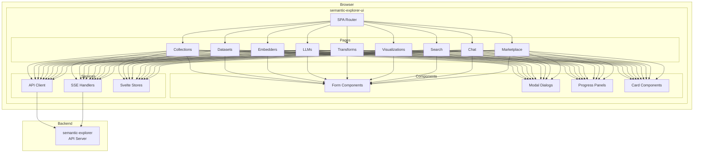
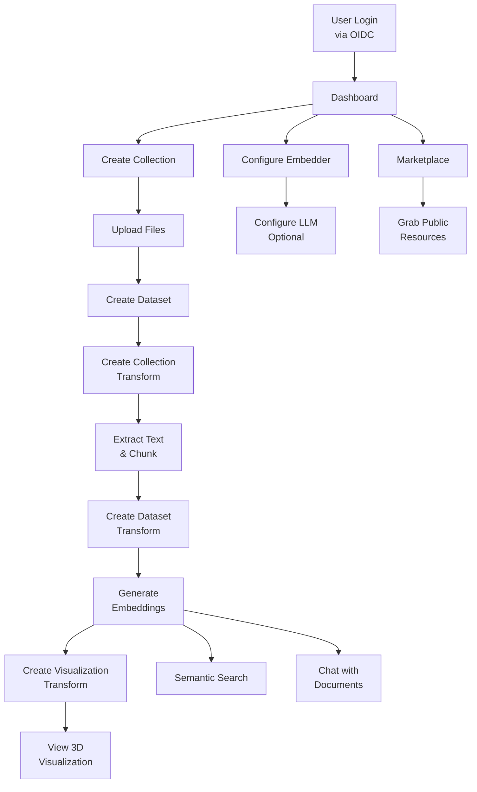

# semantic-explorer-ui

Modern single-page application (SPA) for the Semantic Explorer platform, providing an intuitive interface for document management, semantic search, and interactive data visualizations.

## Overview

The `semantic-explorer-ui` is built with Svelte 5 and provides:

- Document collection management with file uploads
- Dataset creation and item management
- Embedder and LLM provider configuration
- Transform pipeline orchestration with real-time progress
- Interactive 3D visualizations using Deck.gl
- Semantic search across embedded datasets
- Chat with documents using RAG
- Marketplace for discovering public resources
- Dark/light theme support

## Architecture



## User Flow



## Technologies

| Technology      | Version | Purpose                  |
| --------------- | ------- | ------------------------ |
| Svelte          | 5.43    | UI framework             |
| TypeScript      | 5.9     | Type safety              |
| Vite (rolldown) | 7.2     | Build tool               |
| Tailwind CSS    | 4.1     | Styling                  |
| Flowbite Svelte | 1.31    | UI component library     |
| Deck.gl         | 9.2     | WebGL visualizations     |
| marked          | 17.0    | Markdown rendering       |
| highlight.js    | 11.11   | Code syntax highlighting |

## Page Structure

| Page                           | Route                            | Description                    |
| ------------------------------ | -------------------------------- | ------------------------------ |
| Dashboard                      | `/`                              | Overview and quick actions     |
| Collections                    | `/collections`                   | List and create collections    |
| Collection Detail              | `/collections/{id}`              | View/manage collection files   |
| Collection Transforms          | `/collection-transforms`         | Text extraction pipelines      |
| Collection Transform Detail    | `/collection-transforms/{id}`    | Transform details              |
| Datasets                       | `/datasets`                      | List and create datasets       |
| Dataset Detail                 | `/datasets/{id}`                 | View dataset items             |
| Dataset Transforms             | `/dataset-transforms`            | Embedding generation pipelines |
| Dataset Transform Detail       | `/dataset-transforms/{id}`       | Transform details              |
| Embedded Datasets              | `/embedded-datasets`             | Vector collections             |
| Embedded Dataset Detail        | `/embedded-datasets/{id}`        | View embeddings                |
| Embedders                      | `/embedders`                     | Embedder configurations        |
| Embedder Detail                | `/embedders/{id}`                | Edit embedder                  |
| LLMs                           | `/llms`                          | LLM provider configurations    |
| Visualization Transforms       | `/visualization-transforms`      | Visualization pipelines        |
| Visualization Transform Detail | `/visualization-transforms/{id}` | Transform details              |
| Visualizations                 | `/visualizations`                | Generated visualizations       |
| Visualization Detail           | `/visualizations/{id}`           | View visualization             |
| Search                         | `/search`                        | Semantic search interface      |
| Chat                           | `/chat`                          | Chat with documents            |
| Marketplace                    | `/marketplace`                   | Public resources               |
| Sessions                       | `/sessions`                      | Active session management      |
| Documentation                  | `/docs`                          | Help documentation             |

## Component Library

### Form Components

- `FormCard` - Card wrapper for forms
- `FormField` - Input field with label/error
- `SelectField` - Dropdown selection
- `MultiSelectField` - Multi-select with chips
- `TabPanel` - Tabbed content panels

### Action Components

- `ActionMenu` - Dropdown action menu
- `ConfirmDialog` - Confirmation modal
- `StatusBadge` - Status indicator badge

### Progress Components

- `UploadProgressPanel` - File upload progress
- `DatasetTransformProgressPanel` - Transform progress
- `TransformCard` - Transform status card
- `TransformsList` - List of transforms

### Modal Components

- `CreateCollectionTransformModal` - Create extraction pipeline
- `CreateDatasetTransformModal` - Create embedding pipeline
- `CreateVisualizationTransformModal` - Create visualization

### Utility Components

- `ErrorBoundary` - Error handling wrapper
- `ToastHost` - Toast notifications
- `ThemeToggle` - Dark/light mode switch
- `StatsGrid` - Statistics display

## State Management

The application uses Svelte 5 runes and stores for state management:

```typescript
// User state
let user = $state<User | null>(null);

// Collections list
let collections = $state<Collection[]>([]);

// Loading states
let loading = $state(false);

// Derived state
let filteredItems = $derived(items.filter((item) => item.title.includes(searchQuery)));
```

## API Client

API calls are made through a centralized client:

```typescript
// src/lib/api/api.ts
export async function getCollections(): Promise<Collection[]> {
	const response = await fetch('/api/collections');
	if (!response.ok) throw new Error('Failed to fetch collections');
	return response.json();
}

export async function createCollection(data: CreateCollectionRequest): Promise<Collection> {
	const response = await fetch('/api/collections', {
		method: 'POST',
		headers: { 'Content-Type': 'application/json' },
		body: JSON.stringify(data),
	});
	if (!response.ok) throw new Error('Failed to create collection');
	return response.json();
}
```

## Server-Sent Events (SSE)

Real-time updates are received via SSE:

```typescript
// Transform progress streaming
const eventSource = new EventSource(`/api/dataset-transforms/${transformId}/stream`);

eventSource.addEventListener('progress', (event) => {
	const data = JSON.parse(event.data);
	updateProgress(data.processed, data.total);
});

eventSource.addEventListener('complete', () => {
	eventSource.close();
	showSuccess('Transform completed!');
});
```

## Visualization Integration

Interactive visualizations use Deck.gl:

```typescript
import { Deck, ScatterplotLayer } from 'deck.gl';

const deck = new Deck({
	canvas: 'deck-canvas',
	initialViewState: {
		longitude: 0,
		latitude: 0,
		zoom: 1,
	},
	layers: [
		new ScatterplotLayer({
			data: points,
			getPosition: (d) => [d.x, d.y],
			getColor: (d) => clusterColors[d.cluster],
			getRadius: 5,
			pickable: true,
			onHover: ({ object }) => setTooltip(object),
		}),
	],
});
```

## Development

### Prerequisites

- Node.js 20+
- npm or pnpm

### Setup

```bash
# Install dependencies
npm install

# Start development server
npm run dev

# Type checking
npm run check

# Linting
npm run lint

# Formatting
npm run format
```

### Build

```bash
# Production build
npm run build

# Preview production build
npm run preview

# Watch mode for development
npm run build-watch
```

## Project Structure

```
semantic-explorer-ui/
├── src/
│   ├── lib/
│   │   ├── api/           # API client functions
│   │   ├── components/    # Reusable UI components
│   │   ├── pages/         # Page components (routes)
│   │   └── stores/        # Svelte stores
│   ├── App.svelte         # Root application component
│   ├── main.ts            # Application entry point
│   └── app.css            # Global styles
├── public/                # Static assets
├── index.html             # HTML template
├── vite.config.ts         # Vite configuration
├── svelte.config.js       # Svelte configuration
├── tailwind.config.js     # Tailwind configuration
├── tsconfig.json          # TypeScript configuration
└── package.json           # Dependencies and scripts
```

## Configuration

### Vite Configuration

```typescript
// vite.config.ts
export default defineConfig({
	plugins: [svelte()],
	server: {
		proxy: {
			'/api': 'http://localhost:8080',
			'/auth': 'http://localhost:8080',
		},
	},
	build: {
		outDir: 'dist',
		sourcemap: true,
	},
});
```

### Tailwind Configuration

```javascript
// tailwind.config.js
export default {
	content: ['./src/**/*.{svelte,ts}'],
	darkMode: 'class',
	theme: {
		extend: {
			colors: {
				// Custom color palette
			},
		},
	},
	plugins: [require('@tailwindcss/forms'), require('@tailwindcss/typography')],
};
```

## Deployment

### Static Hosting

The built application can be served from any static hosting:

```bash
npm run build
# Output in dist/
```

### With API Server

The API server serves the UI from `/dist`:

```yaml
# In API deployment
volumes:
  - ./semantic-explorer-ui/dist:/app/semantic-explorer-ui/dist
```

### Docker Build

```dockerfile
FROM node:20-alpine AS builder
WORKDIR /app
COPY package*.json ./
RUN npm ci
COPY . .
RUN npm run build

FROM nginx:alpine
COPY --from=builder /app/dist /usr/share/nginx/html
COPY nginx.conf /etc/nginx/nginx.conf
```

## Browser Support

- Chrome/Edge (latest 2 versions)
- Firefox (latest 2 versions)
- Safari (latest 2 versions)

WebGL 2.0 support required for visualizations.

## Accessibility

- Semantic HTML structure
- ARIA labels on interactive elements
- Keyboard navigation support
- Focus management in modals
- Color contrast compliance

## Performance

- Code splitting per route
- Lazy loading for heavy components
- Virtual scrolling for large lists
- Optimized bundle with tree shaking
- Asset caching with content hashing

## Theme Support

Toggle between light and dark themes:

```svelte
<script>
	let darkMode = $state(localStorage.getItem('theme') === 'dark');

	$effect(() => {
		document.documentElement.classList.toggle('dark', darkMode);
		localStorage.setItem('theme', darkMode ? 'dark' : 'light');
	});
</script>

<ThemeToggle bind:darkMode />
```

## License

See LICENSE file in repository root.
